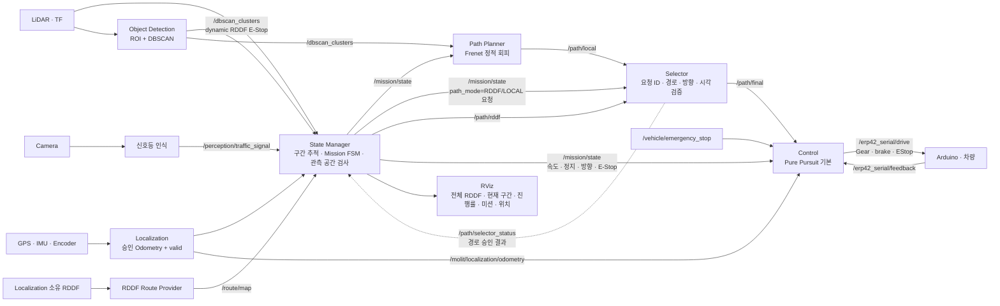

# HL-FMA2026-stier

[현재 패키지 사용 현황·입출력·Mermaid 아키텍처](docs/architecture.md)를 먼저 확인한다.
이 문서는 구현된 패키지와 아직 미통합·미사용 상태인 패키지를 구분한다.

[전체 시스템 아키텍처 탐색기](src/localization/docs/system-architecture.html)는 기존 Localization 중심 구조를 탐색하는 자료입니다. 현재 미션 통합 구조는 아래 아키텍처와 [State Manager 안내서](src/state_manager/README.md)를 기준으로 합니다.
HL Mando Future Mobility Award 2026 자율주행 경진대회 출전을 위한 자율주행 SW

> 현재 작업 브랜치의 Localization은 Mando 코드를 이름·경로만 정렬한 이식본이다.
> State Manager·Selector·Control이 연결되어 Control이 Arduino 명령을 직접 발행한다.
> 현장 기준점·차량 보정과 인지·Planner 연동은 남아 있다. Control은 승인 Odometry와
> Arduino 사이에 연결했으며 `/gps/status` 연결은 별도 작업이다.
> 실행 전 [변경 범위와 남은 차이](src/localization/docs/hl_architecture_alignment.md)를 확인한다.

## 설치 및 최초 설정

지원 환경은 Ubuntu 20.04와 ROS Noetic이다. 아래 명령은 ROS Noetic apt 저장소가 이미
등록되어 있고 `/opt/ros/noetic/setup.bash`가 존재하는 환경을 기준으로 한다.

### 1. 저장소 준비

새 PC에서 처음 받는 경우 다음과 같이 워크스페이스 자체로 clone한다. 이미 clone한 PC에서는
이 단계는 생략한다.

```bash
cd ~
git clone https://github.com/Team-Stier/HL-FMA2026-stier.git
cd ~/HL-FMA2026-stier
```

### 2. 시스템 및 ROS 의존성 설치

현재 센서 드라이버, NTRIP/UTM, RViz 확인 도구와 Arduino rosserial에 필요한 패키지는
다음과 같다.

```bash
sudo apt update
sudo apt install \
  git python3-rosdep python3-serial libgeographic-dev v4l-utils \
  ros-noetic-diagnostic-updater \
  ros-noetic-mavros-msgs \
  ros-noetic-nmea-msgs \
  ros-noetic-rplidar-ros \
  ros-noetic-rosserial-arduino \
  ros-noetic-rosserial-python \
  ros-noetic-rqt-image-view \
  ros-noetic-rqt-runtime-monitor \
  ros-noetic-rtcm-msgs \
  ros-noetic-rviz \
  ros-noetic-tf2-ros \
  ros-noetic-topic-tools \
  ros-noetic-usb-cam
```

`rosdep`을 이 PC에서 처음 사용하는 경우 한 번만 초기화한다. 이미 초기화됐다는 메시지가
나오면 `rosdep update`부터 실행한다.

```bash
sudo rosdep init
rosdep update
```

저장소에 선언된 나머지 의존성을 설치한다.

```bash
cd ~/HL-FMA2026-stier
source /opt/ros/noetic/setup.bash
rosdep install --from-paths src --ignore-src -r -y
```

### 3. 워크스페이스 빌드

```bash
cd ~/HL-FMA2026-stier
source /opt/ros/noetic/setup.bash
catkin_make
source devel/setup.bash
```

새 터미널을 열 때마다 다음 세 줄을 다시 실행한다.

```bash
cd ~/HL-FMA2026-stier
source /opt/ros/noetic/setup.bash
source devel/setup.bash
```

### 4. 센서 고정 장치 이름 설치

udev 규칙은 실행 PC마다 한 번 설치한다. 설치 후 센서를 뺐다가 다시 연결해야 한다.

```bash
cd ~/HL-FMA2026-stier
./src/sensor_drivers/lidar/scripts/install_udev_rules.sh
./src/sensor_drivers/cam/scripts/install_udev_rules.sh
./src/sensor_drivers/gps/scripts/install_udev_rules.sh
./src/sensor_drivers/imu/scripts/install_udev_rules.sh
```

연결된 센서에 해당하는 심볼릭 링크만 존재하면 정상이다.

```bash
ls -l /dev/lidar /dev/cam /dev/gps /dev/imu
```

센서별 설치, 장치 식별 및 문제 해결은 [sensor_drivers 안내서](src/sensor_drivers/README.md),
공유 메시지는 [interfaces 안내서](src/interfaces/README.md), Arduino rosserial은
[vehicle interface 안내서](src/interfaces/vehicle_interface/README.md)를 참고한다.


## Convention

### 좌표계

- 모든 좌표계는 ROS REP-103의 오른손 좌표계를 따른다. 거리 단위는 m, 각도 단위는 rad를
  사용한다.
- 차량 기준 프레임은 `base_link`이며 차량의 진행 방향을 `+x`, 진행 방향의 왼쪽을 `+y`,
  위쪽을 `+z`로 정의한다. 위에서 봤을 때 반시계 방향의 yaw를 양수로 사용한다.
- 전역 프레임 `map`은 로컬 ENU 좌표계(`+x`: 동쪽, `+y`: 북쪽, `+z`: 위쪽)를 사용한다.
  GNSS의 WGS84 위도·경도·고도는 Localization Node에서 `map` 좌표로 변환한다.
- 각 센서 메시지는 센서 고유의 프레임을 `header.frame_id`에 기록한다. 센서 데이터를
  직접 회전하거나 `base_link`로 잘못 표기하지 않고, 실차에서 측정한 장착 위치와 자세를
  정적 TF로 표현한다.
- 카메라의 optical frame은 ROS 관례에 따라 `+z` 전방, `+x` 오른쪽, `+y` 아래쪽을
  사용하며 `camera_link`와 `camera_optical_frame` 사이의 TF로 연결한다.

기본 TF 트리는 다음과 같다.

```text
map
└── odom
    └── base_link
        ├── gps_link
        ├── imu_link
        ├── laser
        └── camera_link
            └── camera_optical_frame
```

RViz와 센서 융합 노드는 `base_link`, `odom` 또는 `map`을 공통 기준 프레임으로 사용한다.
센서별 프레임의 축이 차량 축과 다르더라도 TF를 통해 공통 기준 프레임에서 올바른 위치와
방향으로 변환되어야 한다.

## 패키지 구조 설계

- 각 패키지의 소스 코드, 설정, 모델, 테스트 및 패키지 전용 실행 스크립트는 반드시
  `src/<package_name>/` 안에 둔다. 패키지를 개발하면서 저장소 루트나 다른 패키지
  폴더에 소스 코드가 역류하지 않도록 주의한다.
- 프로젝트 내부 패키지는 메시지 전용 `perception_interfaces`, `sensor_interfaces`, `planning_interfaces`,
  `erp42_msgs` 패키지를 제외한 다른 내부 패키지를
  직접 참조하지 않는다. 다른 패키지의 Python 모듈을 import하거나 소스 파일을 상대
  경로로 읽지 않으며, `package.xml`과 빌드 설정에도 다른 내부 패키지 의존성을 추가하지
  않는다. 현재 미션 통합의 명시적 예외는 `state_manager`가 `selector.core`의 순수 Python
  경로 검증 로직을 공유하는 의존성과, bringup에 필요한 실행 패키지 의존성이다.
  실행 중인 노드의 내부 상태를 직접 참조하지 않으며 RDDF는 소유 패키지의 Provider가 제공한다.
- 내부 패키지 간 데이터 전달은 ROS 토픽, 서비스 또는 액션으로만 수행한다. 패키지
  사이에서 공유해야 하는 인지 메시지는 `perception_interfaces`에, 센서 상태 메시지는
  `sensor_interfaces`에, 미션·경로·주행 안전 메시지는 `planning_interfaces`에,
  차량 통신 메시지는 `erp42_msgs`에 정의한다.
- `roscpp`, `rospy`, `std_msgs`, `sensor_msgs`, `nav_msgs`와 같은 ROS Noetic 패키지 및 필요한
  외부 라이브러리 의존성은 각 패키지에서 명시적으로 선언할 수 있다.
- Git에는 `src/` 아래의 패키지 소스와 저장소 루트의 개발 설정만 추적한다. Catkin의
  `build/`, `devel/`, `install/`, ROS 로그·bag 및 로컬 개발 도구 산출물은 `.gitignore`로
  제외한다.

### 패키지 구성

```text
src/
├── interfaces/
│   ├── perception_interfaces/
│   ├── sensor_interfaces/
│   ├── planning_interfaces/
│   └── vehicle_interface/
│       └── erp42_msgs/
├── sensor_drivers/
│   ├── sensor_bringup/       # 센서 + 선택적 Arduino 통합 launch
│   ├── arduino/
│   │   └── ros/              # vehicle_interface_bringup + 직렬 포트 설정
│   ├── lidar/
│   ├── cam/
│   ├── gps/
│   └── imu/
├── stier_bringup/             # 센서부터 차량 제어까지 전체 실차 launch
├── traffic_light/
├── localization/
├── object_detection/
├── state_manager/              # 구간·미션·LiDAR 관측 검사·RViz
├── path_planner/               # Frenet 기반 ROS 비의존 경로 계획 코어
├── selector/
└── control/
```

메시지 패키지는 공유 타입만 제공하고, 실행 패키지는 필요한 노드를 각 패키지 안에 둔다.
RDDF는 기존 `localization/rddf`가 소유하며 같은 패키지의 Route Provider가 ROS 메시지로
공급한다. 별도의 `route_manager` 패키지는 만들지 않았다. `state_manager` launch는
Provider·미션 노드·Selector·PP Control과 선택적인 RViz·기준점 편집기를 함께 실행한다.

## ROS architecture

현재 브랜치에는 RDDF 기반 State Manager, 경로 검증 Selector, 기본 Pure Pursuit Control,
최종 차량 명령을 Control이 직접 발행한다. 실행 방법, 메시지 계약, 규정 근거와 현장 보정 절차는
[State Manager 안내서](src/state_manager/README.md)를 참고한다.



### State Manager의 역할

`state_manager` 내부는 ROS와 무관한 규칙 엔진, 경로 geometry/tracker, 이들을 연결하는
runtime과 ROS 어댑터로 나뉜다. Localization은 위치 추정의 유효성을 판단하고,
State Manager는 승인된 위치가 어느 RDDF 구간에 있으며 어떤 미션을 수행해야 하는지 판단한다.

| 구성요소 | 현재 책임 |
|---|---|
| Route Tracker | 활성 RDDF 투영, 진행률·방향 확인, 허용된 다음 구간으로 전이 |
| Mission Engine | 구간별 미션 단계, 신호 대기, 정차 시간, 주차·종료 분기와 규정 진단 |
| RDDF Route Provider | Localization 패키지가 소유한 RDDF를 공유 메시지로 제공; 활성 기본 경로는 State Manager가 발행 |
| Local Path Planner | 3구간 정적 회피 궤적 생성; 주차는 별도 Planner 없이 RDDF 사용 |
| Selector | 요청과 일치하는 경로만 최종 경로로 전달하고 준비 상태 발행 |
| Control | 기본 PP(선택 Stanley); 경로·Odometry·MissionState를 받아 Arduino 최종 명령 발행 |

State Manager는 `/path/final`을 직접 발행하지 않는다. Selector는 현재
`decision_id`, 구간, 모드, 방향에 맞는 경로만 선택한다. 구간이나 요청이 바뀌면 이전
Planner 응답은 사용할 수 없다. 요청한 `LOCAL` 경로가 없으면 정지하며 기본 RDDF로
자동 대체하지 않는다.

### 구간별 미션

| RDDF 구간 | 동작 |
|---|---|
| 1-L/R | 앞·뒤 정지구역 마커의 RDDF 중앙에서 연속 3초 이상 정차, 최초 정지부터 정상부 통과 30초 및 0.5 m 이상 밀림 감시 |
| 2 | 비허용 신호에서 정지선 가상 벽으로 RDDF 제한, 초록불에 RDDF 직진 |
| 3 | S자 코스의 정적 장애물 회피; `LOCAL` 경로 요구 |
| 4 | 초록불에 교차로 통과하면서 다음 T자 주차 후보를 LiDAR로 미리 평가 |
| 5-L/R → 6-L/R | 비어 있는 T자 후보 선택, 주차 확인 정차 후 같은 쪽 탈출 경로 사용 |
| 7 | 가상 벽 앞에서 대기, 좌회전 화살표 신호에 RDDF 좌회전 |
| 8 | RDDF 이름의 `dynamic` 조건에서 DBSCAN 군집이 전방 RDDF 주행 폭과 겹치면 E-Stop, 사라지면 RDDF 추종 재개 |
| 9 | RDDF 추종과 함께 다음 평행주차 좌우 후보를 미리 평가 |
| 10-L/R → 11-L/R | 선택한 평행주차 RDDF를 구간별 전진·후진으로 추종하고 전환점에서 정차 후 기어 변경 |
| 12 | `finish_branch` 고정 설정을 따라 왼쪽은 구간 내부 분기점에서, 오른쪽은 끝점에서 13번으로 연결 |
| 13-L/R | 선택된 RDDF 끝에서 마지막 방향으로 3 m 연장한 경로까지 추종한 뒤 정지 |

주차 좌우 분기는 `missions.json`에서 선택한다. T자·평행주차 모두 기록된 RDDF를 사용하고,
평행주차의 전환 누적거리는 `parallel_parking_profiles`에 기록한다. 차량이 전환점에서
실제로 멈춘 뒤 새 방향과 요청 ID의 RDDF를 받는다. 후진 명령 인터페이스와 Arduino
0속도 기어 전환 인터록은 연결됐지만 실차 방향 검증은 필요하다.

### 규정과 전이 처리

- 경사로는 확정된 허용 정지구역 앞·뒤 경계의 RDDF 중앙을 목표로 연속 3초 이상 정차한다.
  속도와 실제 위치 변화로 밀림을 감시하고 연속 정차 시간을 초기화한다. 기존 경사로 전체
  시작·정상 설정은 1m 안쪽 규정 범위를 유지한다. 실제 브레이크 유지는 추후 제어기 연동 영역이다.
- 2·4번은 `GREEN`, 7번은 `LEFT_ARROW`에서 가상 벽을 해제하고 RDDF를 추종한다.
  비허용 신호에서는 정지선 앞범퍼/여유거리 이전까지만 경로를 생성한다. RViz에는 붉은 벽을 표시하고
  `/mission/traffic_constraint`를 진단·검증용으로 발행한다. 현재 신호 구간은 모두 RDDF
  모드이므로 이 메시지를 Frenet `path_planner` 입력으로 연결하지 않는다.
  잘못된 구간의 신호, 오래된 신호, 미래 시각의 신호는 진입 허가로 사용하지 않는다.
  허가를 받아 진입한 뒤에는 신호가 바뀌었다는 이유만으로 교차로 안에서 멈추지 않는다.
- 교차로 진입 후 3초·20초 정차 및 30초 통과 제한을 진단하고, 활성 RDDF 끝에서
  해당 신호 구간 완료로 판단한다. 제한 시간이 임박해도 장애물·위치·경로 검사를 생략하지 않는다.
- 유효한 위치로 실제 출발한 시점부터 전체 480초 제한을 감시하며, 앞 범퍼가 정지선 1 m 이내인 실제 적색 신호 대기 시간은
  관측이 연속적으로 유효한 동안 제외한다. 60초 무이동도 별도로 진단한다.
- 8번은 객체 종류·속도를 별도로 분류하지 않는다. fresh DBSCAN 군집이 현재 RDDF의
  `lookahead_m`와 `corridor_half_width_m` 안에 들어오는지만 State Manager가 판단하며,
  이 판정은 차량 치수 설정을 요구하지 않는다.
- 12번에서 13-left로 가는 연결은 12번 끝점과 다르다. 구간 연결, 진행 방향과 관측
  이력을 함께 사용하므로 가까운 다른 구간으로 최근접 검색만으로 전이하지 않는다.

### 현장 보정과 남은 연동

RDDF에는 각 점의 ENU 좌표·위경도·누적 거리·방향이 있다. 정지선,
경사로 시작·정지점·정상부와 주차 확인선이라는 의미는 CSV에 따로 기록되어
있지 않다. 이 지점은 RViz 보정 도구로 선택하고 실제 기준점·범퍼/후륜 오프셋을
검증해야 한다. 보정값이 없으면 해당 미션을 시작하지 않는다.

현재 State Manager와 Control은 기존 Localization의 승인 Odometry를 사용하고 State Manager는
유효성 신호도 연결한다. `/gps/status` 연결 작업과는 별개이며, Raw EKF 출력을
승인 출력처럼 취급하지 않는다. 전체 센서, 차체 폭·앞뒤 돌출 길이, TF, 제동 성능과
연석 검출 가능 높이도 현장에서 확인해야 한다.

LiDAR는 모든 구간에서 계속 사용한다. 관측된 장애물이나 확인되지 않은 공간이 차량
이동 영역에 있으면 정지를 요구한다. 2D LiDAR의 장착 높이 때문에 보이지 않는 낮은
연석까지 소프트웨어만으로 충돌 방지를 보장할 수는 없으므로, 차량·센서 검증 전에는
실차 출력을 활성화하지 않는다. 기본 실행은 차량 명령 미리보기다.

카메라 기반 차로 제어는 사용하지 않는다. Traffic Light, Object Detection, Local Planner,
Selector와 Control은 연결됐고 주차는 RDDF 모드로 동작한다.
[상세 실행·보정·테스트 안내](src/state_manager/README.md)에서 남은 연동 항목을 확인한다.

### 주요 인터페이스

미션과 경로 공유 타입은 `planning_interfaces` 패키지에 정의한다.
기존 센서·인지 타입은 [interfaces 안내서](src/interfaces/README.md)를 참고한다.

| 토픽 | 타입 | 용도 |
|---|---|---|
| `/route/map` | `planning_interfaces/RouteMap` | RDDF geometry와 방향 제공 |
| `/dbscan_clusters` | `visualization_msgs/MarkerArray` | Local Planner와 dynamic RDDF E-Stop이 공유하는 stamped 군집 |
| `/mission/state` | `planning_interfaces/MissionState` | 요청 ID, 구간·미션·진행률, 분기·모드·방향, 속도·정지·E-Stop 제약 |
| `/mission/safety` | `planning_interfaces/SafetyStatus` | 관측 공간 검사 및 정지 요구 |
| `/path/rddf` | `planning_interfaces/PlannedPath` | 현재 요청에 맞춘 기본 RDDF 경로 |
| `/path/local` | `planning_interfaces/PlannedPath` | Local Planner의 회피 경로 |
| `/path/selector_status` | `planning_interfaces/PathStatus` | 동일 요청의 경로 유효성·준비 상태 |
| `/path/final` | `nav_msgs/Path` | 검증된 최종 추종 경로 |
| `/erp42_serial/drive` | `erp42_msgs/DriveCmd` | Control이 생성한 속도·조향·brake·Gear·EStop 차량 명령 |
| `/vehicle/emergency_stop` | `std_msgs/Bool` | 정상 정지/기어 전환과 분리된 비상정지 입력 |

## Bringup
실행 환경은 Ubuntu 20.04, ROS Noetic이다. 최초 설치는 위의 `설치 및 최초 설정` 절을 먼저
완료한다.
실행 호스트의 Catkin workspace 루트에서 다음 순서로 빌드 결과를 준비한다.

```bash
source /opt/ros/noetic/setup.bash
rosdep install --from-paths src --ignore-src -r -y
catkin_make
source devel/setup.bash
```

전체 실차 구성의 단일 진입점은 `stier_bringup/full_vehicle.launch`다. 센서·Arduino,
Localization, Object Detection, State Manager, Path Planner, Selector와 PP Control을 한
`roslaunch` 프로세스가 관리한다. Localization 내부 드라이버는 비활성화하여
`sensor_bringup`과 동일한 직렬 장치를 중복으로 열지 않는다.

워크스페이스를 빌드한 뒤 다음 중 하나로 실행한다.

```bash
./run.sh
# 또는
roslaunch stier_bringup full_vehicle.launch
```

`run.sh`는 빌드나 여러 백그라운드 프로세스를 직접 관리하지 않고 위 launch를 그대로
실행하는 편의 래퍼다. ROS master가 없으면 `roslaunch`가 자동으로 시작하고 `Ctrl+C` 시
포함된 노드를 함께 종료한다. Arduino 포트와 선택 기능은 launch 인자로 전달한다.

```bash
./run.sh arduino_port:=/dev/ttyACM0 start_rviz:=true
```

GPS 없는 시험은 드라이버와 GPS fusion을 함께 끈다.

```bash
./run.sh enable_gps:=false enable_gps_fusion:=false
```

센서와 Localization을 별도로 실행한 상태에서 미션만 점검하는 기존 launch도 유지한다.
기준점 보정 절차는 [State Manager 안내서](src/state_manager/README.md)에 있다.

```bash
roslaunch state_manager mission.launch start_rviz:=true
```

## 실차 장치 실행 명령 모음

아래 내용은 기존 노드 설계와 별도로 현재 구현된 실차 센서 및 Arduino 통신을 실행하기 위한
빠른 시작 명령이다. 세부 설정과 문제 해결은
[`src/sensor_drivers/README.md`](src/sensor_drivers/README.md)와
[`src/interfaces/vehicle_interface/README.md`](src/interfaces/vehicle_interface/README.md)를 참고한다.

### 공통 환경 준비

```bash
cd ~/HL-FMA2026-stier
source /opt/ros/noetic/setup.bash
catkin_make
source devel/setup.bash
```

### udev 규칙 최초 설치

```bash
./src/sensor_drivers/lidar/scripts/install_udev_rules.sh
./src/sensor_drivers/cam/scripts/install_udev_rules.sh
./src/sensor_drivers/gps/scripts/install_udev_rules.sh
./src/sensor_drivers/imu/scripts/install_udev_rules.sh
```

### RPLIDAR S2

```bash
roslaunch lidar_bringup rplidar_s2.launch
```

RViz의 `Fixed Frame`은 `base_link`, `LaserScan` Topic은 `/scan`으로 설정한다.

### u-blox GPS, NTRIP 및 UTM

```bash
roslaunch gps_bringup gps.launch
```

주요 출력은 `/ublox_position_receiver/fix`, `/ublox_position_receiver/navpvt`,
`/gps/status`, `/utm`이다.

### Xsens MTi-3 IMU

```bash
roslaunch imu_bringup xsens_mti.launch
```

주요 출력은 `/imu/data`이며 frame은 `imu_link`다.

### USB Camera

```bash
roslaunch cam_bringup cam.launch
```

주요 출력은 `/usb_cam/image_raw`이며 frame은 `camera_link`다.

### Arduino rosserial

Arduino용 ROS 헤더는 메시지 정의가 변경될 때 다시 생성한다.

```bash
rosrun rosserial_arduino make_libraries.py ~/Arduino/libraries erp42_msgs std_msgs
```

Arduino 펌웨어를 ROS 모드로 컴파일하고 업로드한 뒤, 기본 포트 설정 또는 실제 연결 포트를
지정해 실행한다.

```bash
roslaunch vehicle_interface_bringup arduino.launch

# 이번 실행에만 설정 덮어쓰기
roslaunch vehicle_interface_bringup arduino.launch \
  port:=/dev/ttyUSB0 baud:=57600
```

무출력 상태에서 다음 명령으로 통신을 확인한다.

```bash
rostopic echo /erp42_serial/feedback

rostopic pub -r 10 /erp42_serial/drive erp42_msgs/DriveCmd \
  "{KPH: 0, Deg: 0, brake: 1, Gear: 1, EStop: 0}"
```

기본값은 `src/sensor_drivers/arduino/ros/config/serial.yaml`에서 바꾸며
`/dev/ttyACM*`, `/dev/ttyUSB*`, `/dev/serial/by-id/*` 경로를 사용할 수 있다. 실차 교정과
E-stop 극성 확인 전에는 Arduino의 액추에이터 출력 잠금을 해제하지 않는다.
