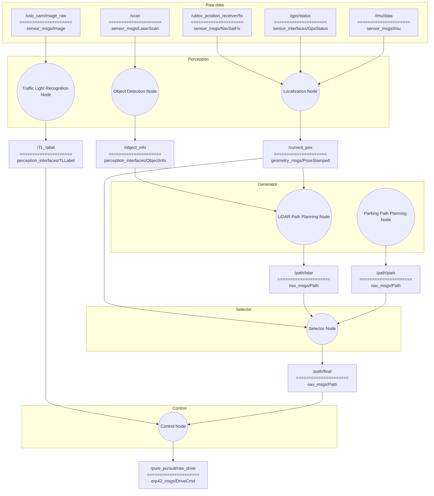

# HL-FMA2026-suhyeon
HL Mando Future Mobility Award 2026 자율주행 경진대회 출전을 위한 자율주행 SW

## 기록한 센서 데이터와 수동 경로 비교

[rosbag 재생·GPS 경로 비교·라이다·카메라 확인 안내](src/localization/docs/bag_replay_comparison.md)에
실제 기록 토픽과 실행 명령을 정리했다. `bag_route_compare.launch`는 위성 지도 편집기에서
저장한 프로젝트 JSON 또는 경로 CSV와 bag의 GPS를 RViz에서 함께 표시한다.
라이다는 별도 RViz 창에서 센서 좌표로 확인한다.

현재 작업 폴더는 `~/HL-FMA2026-suhyeon`이다. 기존 워크스페이스의 소스와 미커밋 작업을
이 저장소의 초기 상태로 옮겼으며, 기존 폴더는 보존했다. bag과 지도 원본은 저장소에
포함하지 않고 로컬 경로로 읽는다. 실센서의 NTRIP 계정 설정은
[GPS 안내](src/sensor_drivers/gps/README.md)를 참고한다.

## 설치 및 최초 설정

지원 환경은 Ubuntu 20.04와 ROS Noetic이다. 아래 명령은 ROS Noetic apt 저장소가 이미
등록되어 있고 `/opt/ros/noetic/setup.bash`가 존재하는 환경을 기준으로 한다.

### 1. 저장소 준비

새 PC에서 처음 받는 경우 다음과 같이 워크스페이스 자체로 clone한다. 이미 clone한 PC에서는
이 단계는 생략한다.

```bash
cd ~
git clone https://github.com/suhyeon-01004/HL-FMA2026-suhyeon.git
cd ~/HL-FMA2026-suhyeon
```

### 2. 시스템 및 ROS 의존성 설치

현재 센서 드라이버, NTRIP/UTM, RViz 확인 도구와 Arduino rosserial에 필요한 패키지는
다음과 같다.

```bash
sudo apt update
sudo apt install \
  git python3-rosdep python3-serial libgeographic-dev v4l-utils \
  ros-noetic-diagnostic-updater \
  ros-noetic-image-view \
  ros-noetic-mavros-msgs \
  ros-noetic-nmea-msgs \
  ros-noetic-rplidar-ros \
  ros-noetic-rosserial-arduino \
  ros-noetic-rosserial-python \
  ros-noetic-rqt-image-view \
  ros-noetic-rqt-runtime-monitor \
  ros-noetic-rtcm-msgs \
  ros-noetic-rviz \
  ros-noetic-tf2-ros \
  ros-noetic-topic-tools \
  ros-noetic-usb-cam
```

`rosdep`을 이 PC에서 처음 사용하는 경우 한 번만 초기화한다. 이미 초기화됐다는 메시지가
나오면 `rosdep update`부터 실행한다.

```bash
sudo rosdep init
rosdep update
```

저장소에 선언된 나머지 의존성을 설치한다.

```bash
cd ~/HL-FMA2026-suhyeon
source /opt/ros/noetic/setup.bash
rosdep install --from-paths src --ignore-src -r -y
```

### 3. 워크스페이스 빌드

```bash
cd ~/HL-FMA2026-suhyeon
source /opt/ros/noetic/setup.bash
catkin_make
source devel/setup.bash
```

새 터미널을 열 때마다 다음 세 줄을 다시 실행한다.

```bash
cd ~/HL-FMA2026-suhyeon
source /opt/ros/noetic/setup.bash
source devel/setup.bash
```

### 4. 센서 고정 장치 이름 설치

udev 규칙은 실행 PC마다 한 번 설치한다. 설치 후 센서를 뺐다가 다시 연결해야 한다.

```bash
cd ~/HL-FMA2026-suhyeon
./src/sensor_drivers/lidar/scripts/install_udev_rules.sh
./src/sensor_drivers/cam/scripts/install_udev_rules.sh
./src/sensor_drivers/gps/scripts/install_udev_rules.sh
./src/sensor_drivers/imu/scripts/install_udev_rules.sh
```

연결된 센서에 해당하는 심볼릭 링크만 존재하면 정상이다.

```bash
ls -l /dev/lidar /dev/cam /dev/gps /dev/imu
```

센서별 설치, 장치 식별 및 문제 해결은 [sensor_drivers 안내서](src/sensor_drivers/README.md),
공유 메시지는 [interfaces 안내서](src/interfaces/README.md), Arduino rosserial은
[vehicle interface 안내서](src/interfaces/vehicle_interface/README.md)를 참고한다.


## Convention

### 좌표계

- 모든 좌표계는 ROS REP-103의 오른손 좌표계를 따른다. 거리 단위는 m, 각도 단위는 rad를
  사용한다.
- 차량 기준 프레임은 `base_link`이며 차량의 진행 방향을 `+x`, 진행 방향의 왼쪽을 `+y`,
  위쪽을 `+z`로 정의한다. 위에서 봤을 때 반시계 방향의 yaw를 양수로 사용한다.
- 전역 프레임 `map`은 로컬 ENU 좌표계(`+x`: 동쪽, `+y`: 북쪽, `+z`: 위쪽)를 사용한다.
  GNSS의 WGS84 위도·경도·고도는 Localization Node에서 `map` 좌표로 변환한다.
- 각 센서 메시지는 센서 고유의 프레임을 `header.frame_id`에 기록한다. 센서 데이터를
  직접 회전하거나 `base_link`로 잘못 표기하지 않고, 실차에서 측정한 장착 위치와 자세를
  정적 TF로 표현한다.
- 카메라의 optical frame은 ROS 관례에 따라 `+z` 전방, `+x` 오른쪽, `+y` 아래쪽을
  사용하며 `camera_link`와 `camera_optical_frame` 사이의 TF로 연결한다.

기본 TF 트리는 다음과 같다.

```text
map
└── odom
    └── base_link
        ├── gps_link
        ├── imu_link
        ├── laser
        └── camera_link
            └── camera_optical_frame
```

RViz와 센서 융합 노드는 `base_link`, `odom` 또는 `map`을 공통 기준 프레임으로 사용한다.
센서별 프레임의 축이 차량 축과 다르더라도 TF를 통해 공통 기준 프레임에서 올바른 위치와
방향으로 변환되어야 한다.

## 패키지 구조 설계

- 각 패키지의 소스 코드, 설정, 모델, 테스트 및 패키지 전용 실행 스크립트는 반드시
  `src/<package_name>/` 안에 둔다. 패키지를 개발하면서 저장소 루트나 다른 패키지
  폴더에 소스 코드가 역류하지 않도록 주의한다.
- 프로젝트 내부 패키지는 메시지 전용 `perception_interfaces`, `sensor_interfaces`,
  `erp42_msgs` 패키지를 제외한 다른 내부 패키지를
  직접 참조하지 않는다. 다른 패키지의 Python 모듈을 import하거나 소스 파일을 상대
  경로로 읽지 않으며, `package.xml`과 빌드 설정에도 다른 내부 패키지 의존성을 추가하지
  않는다.
- 내부 패키지 간 데이터 전달은 ROS 토픽, 서비스 또는 액션으로만 수행한다. 패키지
  사이에서 공유해야 하는 인지 메시지는 `perception_interfaces`에, 센서 상태 메시지는
  `sensor_interfaces`에, 차량 통신 메시지는 `erp42_msgs`에 정의한다.
- `roscpp`, `rospy`, `std_msgs`, `sensor_msgs`, `nav_msgs`와 같은 ROS Noetic 패키지 및 필요한
  외부 라이브러리 의존성은 각 패키지에서 명시적으로 선언할 수 있다.
- Git에는 `src/` 아래의 패키지 소스와 저장소 루트의 개발 설정만 추적한다. Catkin의
  `build/`, `devel/`, `install/`, ROS 로그·bag 및 로컬 개발 도구 산출물은 `.gitignore`로
  제외한다.

### 패키지 구성

```text
src/
├── interfaces/
│   ├── perception_interfaces/
│   ├── sensor_interfaces/
│   └── vehicle_interface/
│       └── erp42_msgs/
├── sensor_drivers/
│   ├── lidar/
│   ├── cam/
│   ├── gps/
│   └── imu/
├── traffic_light/
├── localization/
├── object_detection/
├── lidar_path_planning/
├── parking_path_planning/
├── selector/
└── control/
```

`perception_interfaces`, `sensor_interfaces`, `erp42_msgs`를 제외한 각 실행 패키지는 동명의
노드 하나와 1:1로 대응한다. 세 메시지 패키지는 실행 노드 없이 패키지 사이에서 공유하는
사용자 정의 타입만 제공한다.

## ROS architecture

ROS 관례에 따라 노드는 원으로, 토픽은 사각형으로 표현한다. 토픽 사각형은
구분선 위에 토픽 이름, 아래에 ROS Noetic 메시지 타입을 표시한다.





### Nodes

- **Traffic Light Recognition Node**: `/usb_cam/image_raw`의 카메라 영상에서 신호등 상태를 인식하고, 프로젝트 전용 메시지인 `/TL_label`로 결과를 발행한다.
- **Localization Node**: `/ublox_position_receiver/fix`의 GNSS 위치, `/gps/status`의 위치
  신뢰도, `/imu/data`의 자세·관성 정보를 결합해 차량의 현재 위치와 자세를
  `/current_pos`로 발행한다.
- **Object Detection Node**: `/scan`의 2차원 거리 스캔에서 장애물을 검출하고, 장애물의 중심·크기·경계 정보를 `/object_info`로 발행한다.
- **LiDAR Path Planning Node**: `/object_info`와 `/current_pos`를 이용해 장애물을 회피하는 지역 경로를 생성하고 `/path/lidar`로 발행한다.
- **Parking Path Planning Node**: 주차 상황에서 사용할 경로를 생성하고 `/path/park`로 발행한다.
- **Selector Node**: `/path/lidar`와 `/path/park` 중 현재 주행 상황에 사용할 경로를 선택해 `/path/final`로 발행한다.
- **Control Node**: `/path/final`과 `/TL_label`을 바탕으로 속도·조향·제동 명령을 계산해 `/pure_pursuit/raw_drive`로 발행한다.

### Topics

- **`/ublox_position_receiver/fix`** (`sensor_msgs/NavSatFix`): u-blox 수신기가 발행하는 위도·경도·고도와 GNSS 고정 상태. Localization Node의 입력으로 사용한다.
- **`/gps/status`** (`sensor_interfaces/GpsStatus`): GNSS solution, RTK Float/Fixed,
  spoofing 상태, 사용 위성 수와 수평·수직·속도·방향 예상 정확도. Localization Node가
  GNSS 입력을 사용할지 판단할 때 함께 사용한다.
- **`/imu/data`** (`sensor_msgs/Imu`): Xsens 드라이버가 발행하는 차량의 자세, 각속도 및 선형 가속도. Localization Node의 입력으로 사용한다.
- **`/usb_cam/image_raw`** (`sensor_msgs/Image`): `usb_cam` 드라이버가 발행하는 압축하지 않은 실차 카메라 영상. Traffic Light Recognition Node의 입력으로 사용한다.
- **`/scan`** (`sensor_msgs/LaserScan`): 2D LiDAR 드라이버가 발행하는 거리 스캔. Object Detection Node의 입력으로 사용한다.
- **`/object_info`** (`perception_interfaces/ObjectInfo`): Object Detection Node가 생성한 고정 길이 장애물 메타데이터. 참조 구현의 `lidar_interfaces/ObjectInfo` 필드에 측정 시각과 좌표계를 담는 `std_msgs/Header`를 추가해 `perception_interfaces` 패키지에서 제공한다.

```text
# interfaces/perception_interfaces/msg/ObjectInfo.msg
std_msgs/Header header
int32 objectCounts
float64[100] centerX
float64[100] centerY
float64[100] centerZ
float64[100] lengthX
float64[100] lengthY
float64[100] lengthZ
float64[100] minX
float64[100] minY
float64[100] minZ
float64[100] maxX
float64[100] maxY
float64[100] maxZ
int64[100] pixelX
int64[100] pixelY
```

- **`/TL_label`** (`perception_interfaces/TLLabel`): Traffic Light Recognition Node가 발행하는 프로젝트 전용 신호등 인식 결과. `label`에는 `NOT_DETECTED`, `GREEN`, `YELLOW`, `RED`, `UNKNOWN` 중 하나를 사용한다.

```text
# interfaces/perception_interfaces/msg/TLLabel.msg
std_msgs/Header header

int32 NOT_DETECTED=0
int32 GREEN=1
int32 YELLOW=2
int32 RED=3
int32 UNKNOWN=4

int32 label
```

- **`/current_pos`** (`geometry_msgs/PoseStamped`): Localization Node가 추정한 차량의 현재 위치와 자세.
- **`/path/lidar`** (`nav_msgs/Path`): LiDAR Path Planning Node가 생성한 장애물 회피 경로.
- **`/path/park`** (`nav_msgs/Path`): Parking Path Planning Node가 생성한 주차 경로.
- **`/path/final`** (`nav_msgs/Path`): Selector Node가 선택한 최종 경로. Control Node의 입력으로 사용한다.
- **`/pure_pursuit/raw_drive`** (`erp42_msgs/DriveCmd`): Control Node가 발행하는 차량 명령. `KPH`는 목표 속도, `Deg`는 목표 조향각, `brake`는 제동 명령이다.

### External inputs and outputs

- **Sensor drivers**: `/ublox_position_receiver/fix`, `/gps/status`, `/imu/data`,
  `/usb_cam/image_raw`, `/scan`을 각 인지 노드에 제공한다.
- **Vehicle interface**: `/pure_pursuit/raw_drive`를 받아 조향 명령을 필터링하고 실제 차량 제어기로 전달한다.

## Bringup
실행 환경은 Ubuntu 20.04, ROS Noetic이다. 최초 설치는 위의 `설치 및 최초 설정` 절을 먼저
완료한다.
실행 호스트의 Catkin workspace 루트에서 다음 순서로 빌드 결과를 준비한다.

```bash
source /opt/ros/noetic/setup.bash
rosdep install --from-paths src --ignore-src -r -y
catkin_make
source devel/setup.bash
```

전체 프로그램용 `run.sh`는 source 호출을 감지하면 별도의 Bash 프로세스에서 bringup을
수행해 호출한 셸의 옵션, 작업 디렉터리, trap을 변경하지 않아야 한다. Ubuntu 20.04
실행 호스트에서 `/opt/ros/noetic/setup.bash`를 불러오고 `catkin_make`를 실행한 뒤
workspace의 `devel/setup.bash`를 불러온다. 이어서
Localization → Object Detection → Traffic Light Recognition → LiDAR Path Planning →
Parking Path Planning → Selector → Control 순서로 노드를 시작한다. 상시 실행 노드가
종료되면 전체 프로그램도 종료하고, `Ctrl+C`를 누르면 스크립트가 실행한 모든 노드를
함께 종료한다.

`run.sh`는 기존 ROS master와의 연결을 확인하고, master가 없으면 `roscore`를 시작한다.
센서 드라이버와 차량 인터페이스는 `run.sh`의 관리 대상이 아니며 내부 노드를 시작하기
전에 실행 호스트에서 별도로 준비한다. 실행 호스트의 workspace 루트에서 전체 프로그램을
다음과 같이 시작한다.

```bash
source ./run.sh
```

각 실행 노드 패키지는 `run.sh`가 호출할 한 줄의 `rosrun` 명령을 제공한다. YAML 등
패키지 전용 초기화가 필요한 경우에는 같은 역할을 하는 `./src/<pkgname>/launch.sh`를
사용할 수 있다. Localization은 품질 gate 설정을 빠뜨리지 않도록 `launch.sh`를 사용한다.
메시지 전용 `perception_interfaces`, `sensor_interfaces`, `erp42_msgs` 패키지는 이 규칙의
대상이 아니다. 노드 내부 알고리즘이나 의존성이 추가되더라도 아래 실행 계약은 유지한다.

```bash
./src/localization/launch.sh
rosrun object_detection object_detection_node
rosrun traffic_light traffic_light_node
rosrun lidar_path_planning lidar_path_planning_node
rosrun parking_path_planning parking_path_planning_node
rosrun selector selector_node
rosrun control control_node
```

예를 들어 패키지별 환경변수, 모델 경로, 파라미터 파일 등의 초기화가 필요해
`launch.sh`를 추가했다면, 해당 패키지 개발자는 `run.sh`의 `rosrun` 실행 줄을
다음 `launch.sh` 실행 줄로 직접 교체해야 한다. `run.sh`는 `launch.sh`의 존재 여부를
자동으로 감지하지 않는다. 아래 스크립트는 선택적 실행 계약의 경로 예시이며, 실제
파일을 추가한 패키지에만 적용한다.

```bash
./src/localization/launch.sh
./src/object_detection/launch.sh
./src/traffic_light/launch.sh
./src/lidar_path_planning/launch.sh
./src/parking_path_planning/launch.sh
./src/selector/launch.sh
./src/control/launch.sh
```

## 실차 장치 실행 명령 모음

아래 내용은 기존 노드 설계와 별도로 현재 구현된 실차 센서 및 Arduino 통신을 실행하기 위한
빠른 시작 명령이다. 세부 설정과 문제 해결은
[`src/sensor_drivers/README.md`](src/sensor_drivers/README.md)와
[`src/interfaces/vehicle_interface/README.md`](src/interfaces/vehicle_interface/README.md)를 참고한다.

### 공통 환경 준비

```bash
cd ~/HL-FMA2026-suhyeon
source /opt/ros/noetic/setup.bash
catkin_make
source devel/setup.bash
```

### udev 규칙 최초 설치

```bash
./src/sensor_drivers/lidar/scripts/install_udev_rules.sh
./src/sensor_drivers/cam/scripts/install_udev_rules.sh
./src/sensor_drivers/gps/scripts/install_udev_rules.sh
./src/sensor_drivers/imu/scripts/install_udev_rules.sh
```

### RPLIDAR S2

```bash
roslaunch lidar_bringup rplidar_s2.launch
```

RViz의 `Fixed Frame`은 `base_link`, `LaserScan` Topic은 `/scan`으로 설정한다.

### u-blox GPS, NTRIP 및 UTM

```bash
roslaunch gps_bringup gps.launch
```

주요 출력은 `/ublox_position_receiver/fix`, `/ublox_position_receiver/navpvt`,
`/gps/status`, `/utm`이다.

### Xsens MTi-3 IMU

```bash
roslaunch imu_bringup xsens_mti.launch
```

주요 출력은 `/imu/data`이며 frame은 `imu_link`다.

### USB Camera

```bash
roslaunch cam_bringup cam.launch
```

주요 출력은 `/usb_cam/image_raw`이며 frame은 `camera_link`다.

### Arduino rosserial

Arduino용 ROS 헤더는 메시지 정의가 변경될 때 다시 생성한다.

```bash
rosrun rosserial_arduino make_libraries.py ~/Arduino/libraries erp42_msgs std_msgs
```

Arduino 펌웨어를 ROS 모드로 컴파일하고 업로드한 뒤, 실제 연결 포트에 맞춰 실행한다.

```bash
rosrun rosserial_python serial_node.py _port:=/dev/ttyACM0 _baud:=57600
```

무출력 상태에서 다음 명령으로 통신을 확인한다.

```bash
rostopic echo /erp42_serial/feedback

rostopic pub -r 10 /erp42_serial/drive erp42_msgs/DriveCmd \
  "{KPH: 0, Deg: 0, brake: 1}"
```

Arduino용 고정 udev 이름과 `arduino_bringup` 패키지는 아직 구현하지 않았다. 실차 교정과
E-stop 극성 확인 전에는 Arduino의 액추에이터 출력 잠금을 해제하지 않는다.
