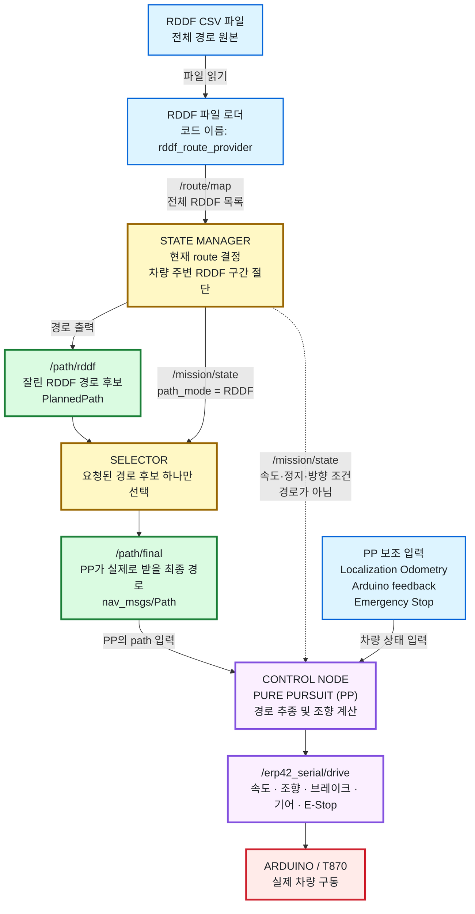
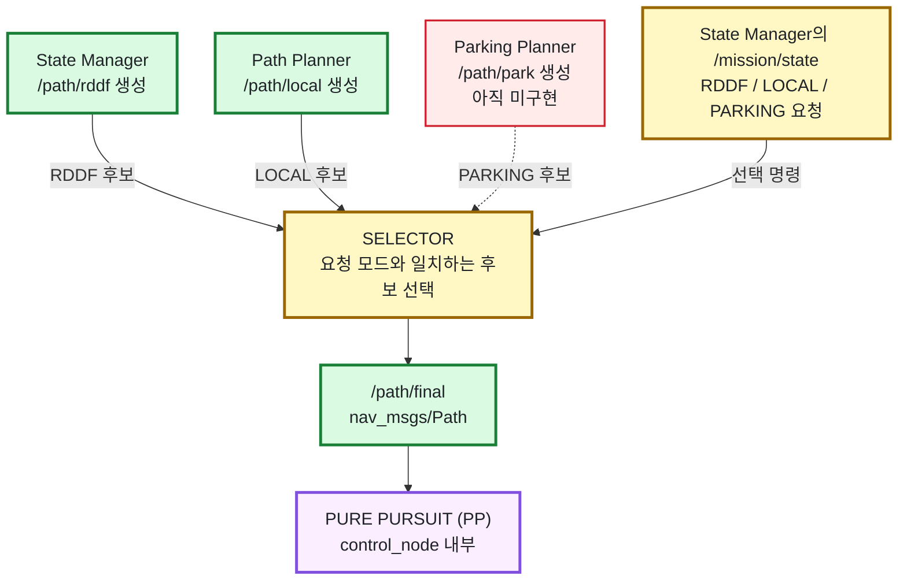
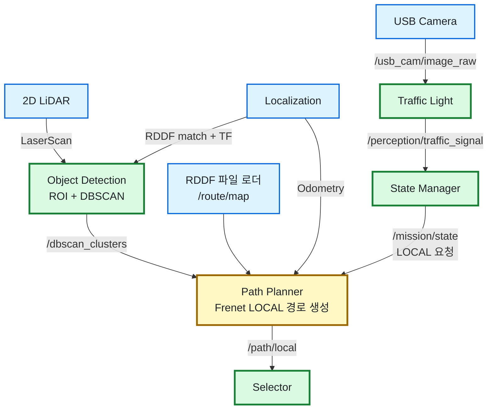

# 시스템 아키텍처와 패키지 사용 현황

이 문서는 2026-09-16 현재 소스와 `state_manager/mission.launch`의 실제 연결을 기준으로
작성했다. GitHub Markdown에서 글자가 작아지지 않도록 핵심 주행 흐름을 세로 방향의
큰 그림으로 표시하고, 보조 입력은 별도 그림으로 분리했다.

## 현재 결론

- 신호등 코드는 `traffic_light` 패키지로 들어왔고 카메라의 일반 신호
  `RED/YELLOW/GREEN/LEFT_ARROW`만 `/perception/traffic_signal`로 발행한다.
- Object Detection의 DBSCAN 출력은 이제 `path_planner` 입력으로 연결된다.
- `path_planner`는 ROS 노드가 되어 `/path/local`을 발행하고 Selector가 이를 선택한다.
- 동적장애물 판정과 카메라 기반 차로 제어는 코드·메시지·아키텍처에서 제거했다.
- 8구간은 일반 RDDF 추종 구간이다. 12구간의 종료 분기는 카메라가 아니라
  `missions.json`의 고정 `finish_branch`로 정한다.
- Parking Planner는 이번 범위에서 구현하거나 연결하지 않았다.
- Control 기본값은 `pure_pursuit`이며 `/path/final`부터 Arduino 명령까지 연결되어 있다.

## 가장 먼저 볼 그림: RDDF 모드에서 PP까지



**PP는 State Manager의 `/path/rddf`를 직접 받지 않는다.** State Manager가 잘라서 만든
`/path/rddf`는 반드시 Selector를 통과하고, PP는 Selector가 내보낸 `/path/final`만
추종한다. State Manager에서 PP로 직접 들어가는 `/mission/state`는 경로가 아니라
목표 속도, 정지 요청, 전진·후진 방향 같은 제어 조건이다.

`rddf_route_provider`는 경로를 판단하는 노드가 아니다. RDDF CSV를 읽어 전체 경로
목록인 `/route/map`으로 바꾸는 파일 로더다. 실제 route 선택과 RDDF 절단은
State Manager가 담당한다.

## RDDF·LOCAL·PARKING 경로 선택



- 일반 구간: `State Manager → /path/rddf → Selector → /path/final → PP`
- 정적 장애물 구간: `Path Planner → /path/local → Selector → /path/final → PP`
- 주차 구간: 향후 `Parking Planner → /path/park → Selector → /path/final → PP`

Selector는 경로를 새로 만들거나 RDDF를 자르지 않는다. State Manager가 요청한
`path_mode`, `decision_id`, `route_name`, `direction`, timestamp가 정확히 맞는 후보만
`/path/final`로 전달한다. 현재 일반 구간은 RDDF, 3번 정적장애물 구간만 LOCAL이다.

## 센서·인지·LOCAL 경로 생성



`object_detection`은 각 스캔의 원래 timestamp와 `map` frame을 DBSCAN MarkerArray에
유지한다. 군집이 0개여도 stamped `DELETEALL` heartbeat를 내므로 Planner가
“유효한 빈 관측”과 센서/TF 실패로 인한 header 없는 clear를 구분한다.

`path_planner` 입력과 출력은 다음과 같다.

| 방향 | 토픽 | 타입 | 용도 |
|---|---|---|---|
| 입력 | `/route/map` | `planning_interfaces/RouteMap` | 현재 RDDF 기준선 |
| 입력 | `/mission/state` | `planning_interfaces/MissionState` | LOCAL 요청, route, decision ID |
| 입력 | `/molit/localization/odometry` | `nav_msgs/Odometry` | 후륜축 위치·자세 |
| 입력 | `/dbscan_clusters` | `visualization_msgs/MarkerArray` | 정적 장애물 군집 |
| 출력 | `/path/local` | `planning_interfaces/PlannedPath` | Selector용 지역 회피 경로 |
| 출력 | `/path_planner/status` | `planning_interfaces/PathStatus` | 준비 여부와 거부 이유 |

실측 차량 길이·폭·축거·후륜축 기준점과 RDDF 좌우 주행 가능 폭은 저장소에 없다.
따라서 `path_planner/config/path_planner.yaml`의 `calibration_required` 기본값은 `true`다.
이 상태에서도 모든 ROS 연결과 진단은 동작하지만 `/path/local`은 발행하지 않는다.
실측값을 채우고 검증한 뒤 `local_planner_calibration_required:=false` launch 인자를
명시해야 한다.

PP 연결은 다음 코드·설정으로 확인된다.

- `mission.launch`의 기본 `lateral_controller`는 `pure_pursuit`다.
- Selector 출력은 `/path/final`이다.
- `control/config/t870_path_tracking.yaml`의 `path_topic`도 `/path/final`이다.
- Control 최종 출력은 `/erp42_serial/drive`이며 별도 Vehicle Safety Gate는 없다.
- Stanley 구현은 남아 있지만 launch 인자를 바꾸지 않는 한 사용하지 않는다.

## State Manager의 현재 구간 정책

| 구간 | path mode | 현재 처리 |
|---|---|---|
| 1 | RDDF | 경사로 정지구역 3초 정차 |
| 2, 4 | RDDF | GREEN과 정지선으로 직진 허가 결정 |
| 3 | LOCAL | DBSCAN 장애물을 사용한 Frenet 정적 회피 경로 필수 |
| 5, 6 | PARKING | T 주차; Planner는 아직 없음 |
| 7 | RDDF | LEFT_ARROW와 정지선으로 좌회전 허가 결정 |
| 8 | RDDF | 동적장애물 판정 없이 일반 RDDF 추종 |
| 9 | RDDF | 평행주차 접근 및 주차 공간 선택 |
| 10, 11 | PARKING | 평행주차; Planner는 아직 없음 |
| 12 | RDDF | `finish_branch` 고정 설정에 따라 13 left/right 연결 |
| 13 | RDDF | 종료선 통과 후 정지 |

신호 정지선은 Frenet Planner 입력이 아니다. 2·4·7구간은 RDDF 모드이며 State Manager가
신호 상태와 정지선으로 경로 길이·정지 요청을 정한다. Selector는 그 RDDF 후보를 고르고,
Control이 속도 상한과 정지 요청을 함께 적용한다.

## Launch 상태

`state_manager/mission.launch` 기본 실행 구성은 다음과 같다.

| 구성 | 기본값 | 비고 |
|---|---:|---|
| RDDF 파일 로더 / State Manager / Selector | 켜짐 | 미션 기본 축 |
| Object Detection | 켜짐 | `/dbscan_clusters` 생산 |
| Local Path Planner | 켜짐 | 실측 보정 전에는 출력 억제 |
| Pure Pursuit Control | 켜짐 | `lateral_controller:=pure_pursuit` |
| Traffic Light | 꺼짐 | 모델 의존성·카메라 준비 후 `start_traffic_light:=true` |
| Parking Planner | 없음 | 추후 작업 |

신호등 실행 예:

```bash
python3 -m pip install -r src/traffic_light/requirements.txt
roslaunch state_manager mission.launch start_traffic_light:=true traffic_light_device:=0
```

## 현재 미사용·추후 작업

| 패키지/기능 | 상태 | 이유 |
|---|---|---|
| `parking_path_planning` | 빈 패키지 | `/path/park`, `/parking/maneuver` 생산 코드 없음 |
| `perception_interfaces/ObjectInfo` | 미사용 계약 | Planner는 stamped DBSCAN MarkerArray를 직접 변환 |
| `perception_interfaces/TLLabel` | 미사용 계약 | 신호등은 `planning_interfaces/SignalObservation` 사용 |
| Stanley | 대체 구현 | 현재 Control 기본 선택은 PP |

카메라 기반 차로 제어와 동적장애물 전용 입력·판정 로직은 현재 범위에서 제거했다.
RDDF 파일명
`8_dynamic-obstacle`은 Localization 경로 자산과 전환 계약을 깨지 않기 위해 그대로지만,
그 이름이 동적 판정 로직이 남아 있다는 뜻은 아니다.

## 남은 실차 작업

1. `path_planner.yaml`에 실측 차량 치수와 3구간 좌우 주행 가능 폭을 기록한다.
2. rosbag 또는 정지 차량에서 빈 관측·단일 장애물·전폭 차단 시나리오를 검증한다.
3. 계산 시간이 `planning_deadline_ms` 안에 들어오는지 실차 PC에서 확인한다.
4. Traffic Light 의존성을 설치하고 카메라 노출·GPU/CPU 지연·confidence를 측정한다.
5. Parking Planner는 전진/후진 leg 계약을 확정한 뒤 별도 브랜치에서 구현한다.
