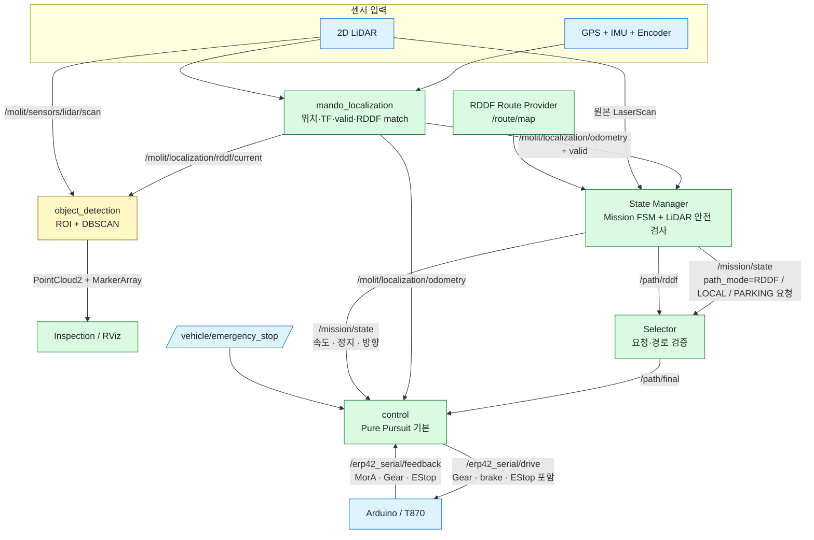
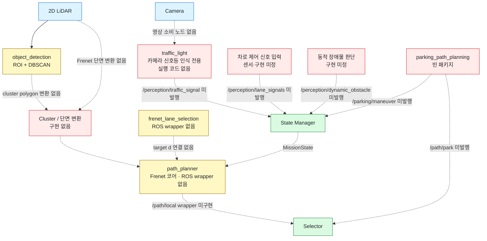
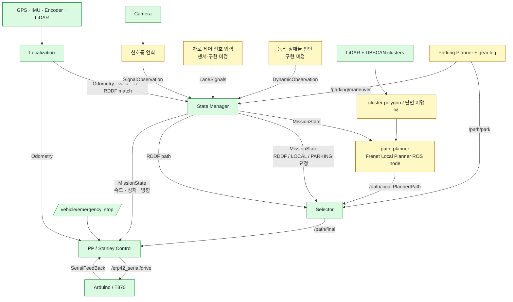

# 시스템 아키텍처와 패키지 사용 현황

이 문서는 2026-09-16 현재 워크스페이스의 **실제 소스와 launch 연결**을 기준으로 한다.
패키지가 빌드된다는 사실과 전체 주행 파이프라인에서 사용된다는 사실을 구분한다.

현재 소스 구성은 다음 기준을 합친 상태다.

- 팀 `main`: `67258e6`
- Object Detection 보존본: `771ab5a`
- Frenet 경로 계획 코어: `8ea33fc`
- Frenet 차선 선택 코어: `47b87a6`
- PP/Stanley 제어기: `0c73bfc`

## 결론

현재 완성된 실행 축은 다음 두 개다.

1. `mando_localization`: 센서 입력을 받아 위치·TF·유효성·현재 RDDF를 계산한다.
2. `state_manager/mission.launch`: Route Provider, State Manager, Selector,
   Pure Pursuit Control을 실행한다.

**Selector → Pure Pursuit → Arduino**는 직접 연결됐다. Vehicle Safety Gate 패키지는
제거했다. 아직 끊긴 축은 인지 → 지역/주차 경로 계획이다.

- `parking_path_planning`, `traffic_light`는 실행 코드가 없는 빈 패키지다.
- `path_planner`, `frenet_lane_selection`은 ROS 노드가 아닌 독립 C++ 라이브러리다.
- Object Detection 출력은 Inspection/RViz에서만 사용하며 Planner 입력으로 연결되지 않았다.
- State Manager의 LiDAR 안전 판단은 Object Detection이 아니라 원본 `LaserScan`을 직접 사용한다.
- `run.sh`는 State Manager 통합 launch를 통해 Control을 한 번만 실행한다. 실행 코드가 없는
  인지·Parking Planner는 여전히 시작할 수 없다.

## 상태 표기

| 상태 | 의미 |
|---|---|
| **통합** | 현재 launch에서 실행되고 다른 패키지와 토픽이 연결됨 |
| **단독** | 실행 코드는 있으나 전체 미션 launch에는 연결되지 않음 |
| **코어** | 알고리즘·메시지·라이브러리만 있으며 실행 노드가 없음 |
| **빈 패키지** | `CMakeLists.txt`와 `package.xml`만 있고 실행 코드가 없음 |
| **지원** | 센서 드라이버, 메시지 생성 또는 외부 라이브러리 역할 |

## 현재 주행 파이프라인에서 미사용·미연결인 패키지

여기서 “미사용”은 소스가 없다는 뜻만이 아니라, 현재 `mission.launch` 기준으로 데이터를
주고받지 않는 상태까지 포함한다.

| 패키지 | 판정 | 이유 |
|---|---|---|
| `parking_path_planning` | **미사용·빈 패키지** | 실행 노드가 없고 `/path/park`, `/parking/maneuver`를 발행하지 않음 |
| `traffic_light` | **미사용·빈 패키지** | 카메라 신호등 인식 전용 자리지만 실행 노드가 없고 `/perception/traffic_signal`을 발행하지 않음 |
| `path_planner` | **미연결 코어** | Frenet 경로 계획 알고리즘과 테스트는 있으나 ROS 노드·토픽 wrapper가 없음 |
| `frenet_lane_selection` | **미연결 코어** | 차선 선택 알고리즘은 있으나 LiDAR/Planner 연결과 ROS wrapper가 없음 |
| `object_detection` | **미션 미사용·검사용** | `inspection.launch`와 RViz에서는 쓰지만 출력이 Planner로 전달되지 않음 |
| `cam_bringup` | **소비자 없음** | 카메라 영상 Publisher는 있으나 현재 영상을 구독하는 인식 노드가 없음 |

`perception_interfaces`와 `sensor_interfaces` 자체는 메시지 지원 패키지다. 다만 전자의
`ObjectInfo`, 후자의 `/gps/status`는 현재 주행 의사결정에서 소비되지 않는다.

## 현재 구현 상태

한 장에 모든 패키지를 넣으면 GitHub가 그림 전체를 문서 폭에 맞추면서 글자가 작아진다.
따라서 실제 실행 흐름과 아직 끊긴 연결을 나눠 표시한다. 실선은 현재 연결된 데이터
흐름이고, 점선은 코드 또는 인터페이스가 빠진 연결이다.

### 현재 연결된 실행 흐름

### 현재 끊겨 있는 인지·계획 연결

## 핵심 실행 패키지

| 패키지 | 상태 | 역할 | 주요 입력 | 주요 출력 |
|---|---|---|---|---|
| `mando_localization` | **통합** | IMU·Encoder·GPS 융합, TF, 품질 게이트, RDDF 매칭; LiDAR 전방 시각화 | `/erp42_serial/feedback`, IMU, GNSS fix/NavPVT; LiDAR는 시각화에만 사용 | `/molit/localization/odometry`, `/molit/localization/valid`, `/molit/localization/rddf/current`, `map → odom → base_link` TF, 전방 scan 시각화 |
| `state_manager` | **통합** | RDDF 구간 추적, 미션 FSM, 신호·주차·동적 장애물 상태, 원본 LiDAR 기반 통로 안전 검사 | `/route/map`, Localization odometry/valid, `/molit/sensors/lidar/scan`, `/perception/*`, `/path/local`, `/path/park`, `/parking/maneuver` | `/mission/state`, `/mission/safety`, `/mission/traffic_constraint`, `/path/rddf`, `/mission/markers`, `/mission/diagnostics` |
| `selector` | **통합** | 현재 `decision_id`, route, 방향, 시각과 일치하는 경로만 선택 | `/mission/state`, `/path/rddf`, `/path/local`, `/path/park` | `/path/final` (`nav_msgs/Path`), `/path/selector_status` |
| `object_detection` | **단독/Inspection** | 현재 RDDF 주변 또는 차량 전방 LiDAR ROI, self-filter, DBSCAN 군집화 | `/molit/sensors/lidar/scan`, `/molit/localization/rddf/current`, TF | `/object_detection/roi_points`, `/object_detection/roi_markers`, `/dbscan_clusters` |
| `control` | **통합** | `/path/final` 추종, 미션 속도·정지·방향 적용, T870 최종 명령 생성 | `/path/final`, `/mission/state`, `/molit/localization/odometry`, `/erp42_serial/feedback`, `/vehicle/emergency_stop` | `/erp42_serial/drive`, 디버그 `/control/*` |
| `path_planner` | **코어** | 기준 RDDF의 Frenet `(s,d)`에서 충돌·경계·곡률을 검사하며 회피 후보 선택 | C++ API: 기준선, 후륜축 pose, 차량 치수, 장애물 polygon | C++ `PlannerResult`; ROS 토픽 없음 |
| `frenet_lane_selection` | **코어** | LiDAR 단면에서 양쪽 도로 경계를 찾고 허용된 좌/우 차선 중심 계산 | C++ API: 단면별 `s,d` 관측, 차선 허가, 현재 차선 | C++ lane target 목록; ROS 토픽 없음 |
| `parking_path_planning` | **빈 패키지** | 향후 주차 궤적과 전·후진 leg 생성 자리 | 없음 | 없음 |
| `traffic_light` | **빈 패키지** | 향후 카메라 신호등 인식 전용 자리 | 카메라 영상 예정 | `/perception/traffic_signal` 예정 |

### Control 통합 상태

Control은 Localization `Odometry`, `/path/final`, `/mission/state`를 받고
`/erp42_serial/drive`를 직접 발행한다. 신호등 정지는 State Manager가 RDDF 경로와
MissionState 정지 요청으로 전달하므로 Control의 옛 `/TL_label` 판단은 제거했다.
정상 정지는 `brake=1, Gear=중립, EStop=0`, 별도 비상정지는
`/vehicle/emergency_stop=true`에서 `EStop=1`로 구분한다. 후진은 PP에서 지원하며
Arduino가 엔코더 0속도를 3회 연속 확인한 뒤 기어 방향을 바꾼다.

## 현재 생성되지 않는 필수 토픽

| 토픽 | 소비자 | 현재 상태 |
|---|---|---|
| `/perception/traffic_signal` | State Manager | Publisher 없음 |
| `/perception/lane_signals` | State Manager | Publisher 없음 |
| `/perception/dynamic_obstacle` | State Manager | Publisher 없음 |
| `/path/local` | State Manager, Selector | Local Planner 없음 |
| `/path/park` | State Manager, Selector | Parking Planner 없음 |
| `/parking/maneuver` | State Manager | Parking Planner 없음 |

이 토픽들이 없을 때 State Manager는 유효하지 않은 미션/빈 경로를 내고 Control은 정지 명령을 낸다.

### 주차 RDDF와 전·후진 정보

`yongin_route_project.json`의 `route_directions`에는 `5_T-left-in`, `5_T-right-in`,
`10_parallel-left-in`이 `reverse`로 명시되어 있다. 따라서 두 `5_T-*-in` 경로는
RDDF 전체를 하나의 후진 leg로 사용할 경우 방향을 그대로 결정할 수 있다.
`10_parallel-right-in`은 요청대로 현재 값을 바꾸지 않았다.

다만 RDDF의 `direction`은 경로 전체의 차량 heading 메타데이터이고 기어 전환 지점은
포함하지 않는다. 한 RDDF 안에서 전진 접근 후 후진 진입처럼 방향이 바뀐다면 RDDF만
보고 전환 위치를 안전하게 추론할 수 없다. 현재 State Manager는 T 주차에서 첫
`FORWARD_APPROACH` 후 `REVERSE_ENTRY`를 요구하므로, `5_T-*-in`의 전체 reverse 메타데이터를
그대로 한 leg로 내보내는 Parking Planner와는 계약이 맞지 않는다. 이 부분은 Parking
Planner 구현 전에 “5번 in 전체 후진” 또는 “경로 내부 gear leg 분리” 중 하나로 확정해야 한다.

## 센서·차량 패키지

센서 드라이버는 `mission.launch`에 포함되지 않는다. 또한
`src/localization/launch.sh`는 `start_encoder_driver`, `start_imu_driver`,
`start_gps_driver`를 모두 `false`로 실행하므로 실제 차량에서는 별도 실행이 필요하다.

| 패키지 | 상태 | 역할 | 주요 출력/계약 |
|---|---|---|---|
| `sensor_bringup` | **통합 실행** | LiDAR·Camera·GPS·IMU와 선택적 Arduino launch 조합 | 센서 토픽을 Localization 계약에 맞춰 remap; Arduino는 기본 비활성 |
| `lidar_bringup` | **단독** | RPLIDAR S2와 정적 TF 실행 | 기본 `/scan`, 기본 frame `laser`. 시스템 계약인 `/molit/sensors/lidar/scan`, `laser_link`로 인자 조정 필요 |
| `cam_bringup` | **단독** | USB 카메라 실행 및 V4L2 설정 | 일반적으로 `/usb_cam/image_raw`; 현재 소비하는 인식 노드 없음 |
| `gps_bringup` | **단독** | u-blox, NTRIP, 상태 요약, UTM 변환 실행 | u-blox fix/NavPVT/NavSTATUS, `/gps/status`, `/gps`, `/utm` |
| `imu_bringup` | **단독** | Xsens 실행 및 측정 covariance 적용 | 기본 `/imu/data`; Localization 내부 드라이버 방식과 별도 구성 |
| `vehicle_interface_bringup` | **단독** | `sensor_drivers/arduino/ros`의 Arduino rosserial 연결; YAML 또는 launch 인자로 ACM/USB/by-id 포트 선택 | MCU가 `/erp42_serial/feedback` 발행 및 `/erp42_serial/drive` 구독 |
| `ublox_gps`, `ublox_utils`, `ntrip_client`, `utm_lla` | **지원** | GNSS 수신, RTCM 보정, 좌표 변환 | GPS bringup 내부에서 사용 |
| `ublox_msgs`, `ublox_serialization`, `ublox` | **지원** | u-blox 메시지·직렬화·메타패키지 | 직접 실행 대상 아님 |
| `xsens_mti_driver` | **지원** | Xsens 장치 드라이버 | `imu_bringup` 또는 Localization 내부 launch가 실행 |

## 인터페이스 패키지

| 패키지 | 상태 | 역할 | 현재 사용 여부 |
|---|---|---|---|
| `planning_interfaces` | **지원/사용 중** | Route, MissionState, PlannedPath, PathStatus, SafetyStatus, 신호·주차 메시지 | State Manager, Selector, Control에서 사용 |
| `erp42_msgs` | **지원/사용 중** | 차량 피드백과 속도·기어·비상정지 주행 명령 | Localization, Control, Arduino에서 사용 |
| `perception_interfaces` | **지원/미사용 계약** | `ObjectInfo`, 기존 `TLLabel` | 현재 Control은 `TLLabel`을 사용하지 않으며 `ObjectInfo`도 Planner에 연결되지 않음 |
| `sensor_interfaces` | **지원/부분 사용** | `GpsStatus` | GPS 노드가 `/gps/status`로 발행하지만 현재 소비자 없음 |

## Launch 구성

| 실행 진입점 | 포함하는 구성 | 판단 |
|---|---|---|
| `sensor_bringup/sensors.launch` | LiDAR, Camera, GPS, IMU, 선택적 Arduino | 현재 센서 통합 진입점; Localization 토픽 계약 적용 |
| `src/localization/launch.sh` | Localization, TF, RDDF tracking; 센서 드라이버와 RViz는 비활성 | 현재 위치 추정 진입점 |
| `state_manager/mission.launch` | Route Provider, State Manager, Selector, PP Control | 현재 미션 통합 진입점; Control이 차량 명령을 직접 발행 |
| `state_manager/inspection.launch` | 위 미션 구성 + Object Detection + Inspection RViz | 현재 가장 완성된 관찰·검증 진입점 |
| `object_detection/rddf_roi_detection.launch` | ROI detector, 선택적 전용 viewer | Object Detection 단독 검증 |
| `control/control.launch` | PP 또는 Stanley Control | 단독 알고리즘·토픽 시험용 |
| 루트 `run.sh` | 센서 외 상위 패키지 실행 후 State Manager 통합 launch 시작 | Control은 통합 launch에서 한 번만 실행 |

## 목표 아키텍처

## 권장 통합 순서

1. Object Detection cluster를 `path_planner::Obstacle2d`로 변환하는 timestamp·TF 검증 어댑터를 만든다.
2. `path_planner` ROS wrapper가 `/mission/state`를 받아
   `/path/local` `PlannedPath`를 발행하도록 구현한다.
3. `frenet_lane_selection`의 목표 `d`를 Frenet 기준선 또는 명시적 target profile에 연결한다.
4. Parking Planner가 단계별 전·후진 경로와 `/parking/maneuver`를 발행하도록 구현한다.
5. 카메라 신호등 Publisher를 구현하고, 차로 신호·동적 장애물 입력원은 별도로 결정한다.
6. 마지막에 센서, Localization, Mission, Planning, Control을 하나의 검증된 bringup으로 묶는다.
