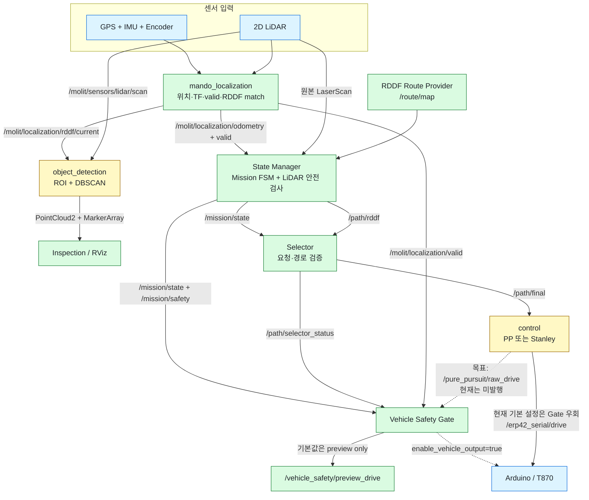
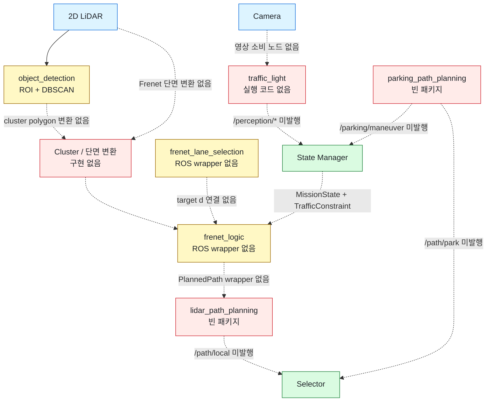
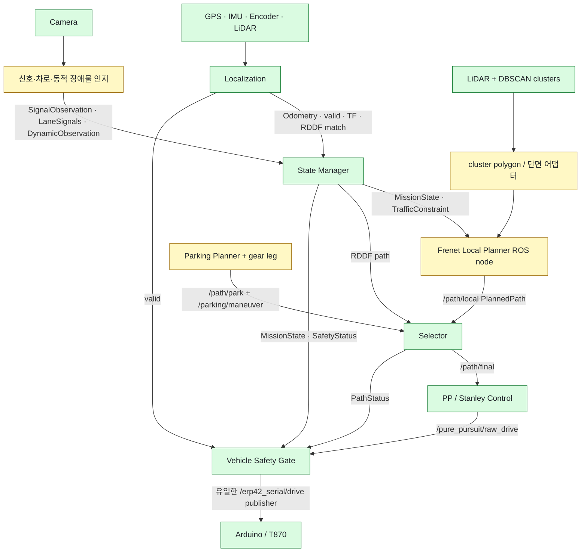

# 시스템 아키텍처와 패키지 사용 현황

이 문서는 2026-09-16 현재 워크스페이스의 **실제 소스와 launch 연결**을 기준으로 한다.
패키지가 빌드된다는 사실과 전체 주행 파이프라인에서 사용된다는 사실을 구분한다.

현재 소스 구성은 다음 기준을 합친 상태다.

- 팀 `main`: `67258e6`
- Object Detection 보존본: `771ab5a`
- Frenet 경로 계획 코어: `8ea33fc`
- Frenet 차선 선택 코어: `47b87a6`
- PP/Stanley 제어기: `0c73bfc`

## 결론

현재 완성된 실행 축은 다음 두 개다.

1. `mando_localization`: 센서 입력을 받아 위치·TF·유효성·현재 RDDF를 계산한다.
2. `state_manager/mission.launch`: Route Provider, State Manager, Selector,
   Vehicle Safety Gate를 실행한다.

하지만 **인지 → 지역 경로 계획 → 제어 → Safety Gate → 차량**은 아직 연결되지 않았다.

- `lidar_path_planning`, `parking_path_planning`, `traffic_light`는 실행 코드가 없는 빈 패키지다.
- `frenet_logic`, `frenet_lane_selection`은 ROS 노드가 아닌 독립 C++ 라이브러리다.
- `control`에는 PP/Stanley가 구현되어 있지만 Localization 및 Safety Gate의 현재 토픽 계약과 다르다.
- Object Detection 출력은 Inspection/RViz에서만 사용하며 Planner 입력으로 연결되지 않았다.
- State Manager의 LiDAR 안전 판단은 Object Detection이 아니라 원본 `LaserScan`을 직접 사용한다.
- `run.sh`는 존재하지 않는 예전 노드 이름을 포함하고 Control 파라미터도 로드하지 않으므로,
  현재 시스템의 정상 통합 실행기로 간주하지 않는다.

## 상태 표기

| 상태 | 의미 |
|---|---|
| **통합** | 현재 launch에서 실행되고 다른 패키지와 토픽이 연결됨 |
| **단독** | 실행 코드는 있으나 전체 미션 launch에는 연결되지 않음 |
| **코어** | 알고리즘·메시지·라이브러리만 있으며 실행 노드가 없음 |
| **빈 패키지** | `CMakeLists.txt`와 `package.xml`만 있고 실행 코드가 없음 |
| **지원** | 센서 드라이버, 메시지 생성 또는 외부 라이브러리 역할 |

## 현재 주행 파이프라인에서 미사용·미연결인 패키지

여기서 “미사용”은 소스가 없다는 뜻만이 아니라, 현재 `mission.launch` 기준으로 데이터를
주고받지 않는 상태까지 포함한다.

| 패키지 | 판정 | 이유 |
|---|---|---|
| `lidar_path_planning` | **미사용·빈 패키지** | 실행 노드가 없고 `/path/local`을 발행하지 않음 |
| `parking_path_planning` | **미사용·빈 패키지** | 실행 노드가 없고 `/path/park`, `/parking/maneuver`를 발행하지 않음 |
| `traffic_light` | **미사용·빈 패키지** | 실행 노드가 없고 `/perception/*` 또는 `/TL_label`을 발행하지 않음 |
| `frenet_logic` | **미연결 코어** | 알고리즘과 테스트는 있으나 ROS 노드·토픽 wrapper가 없음 |
| `frenet_lane_selection` | **미연결 코어** | 차선 선택 알고리즘은 있으나 LiDAR/Planner 연결과 ROS wrapper가 없음 |
| `control` | **미통합 실행 코드** | PP/Stanley는 구현됐으나 위치 입력과 Safety Gate 출력 계약이 불일치 |
| `object_detection` | **미션 미사용·검사용** | `inspection.launch`와 RViz에서는 쓰지만 출력이 Planner로 전달되지 않음 |
| `cam_bringup` | **소비자 없음** | 카메라 영상 Publisher는 있으나 현재 영상을 구독하는 인식 노드가 없음 |

`perception_interfaces`와 `sensor_interfaces` 자체는 메시지 지원 패키지다. 다만 전자의
`ObjectInfo`, 후자의 `/gps/status`는 현재 주행 의사결정에서 소비되지 않는다.

## 현재 구현 상태

한 장에 모든 패키지를 넣으면 GitHub가 그림 전체를 문서 폭에 맞추면서 글자가 작아진다.
따라서 실제 실행 흐름과 아직 끊긴 연결을 나눠 표시한다. 실선은 현재 연결된 데이터
흐름이고, 점선은 코드 또는 인터페이스가 빠진 연결이다.

### 현재 연결된 실행 흐름

### 현재 끊겨 있는 인지·계획 연결

## 핵심 실행 패키지

| 패키지 | 상태 | 역할 | 주요 입력 | 주요 출력 |
|---|---|---|---|---|
| `mando_localization` | **통합** | IMU·Encoder·GPS 융합, TF, 품질 게이트, RDDF 매칭; LiDAR 전방 시각화 | `/erp42_serial/feedback`, IMU, GNSS fix/NavPVT; LiDAR는 시각화에만 사용 | `/molit/localization/odometry`, `/molit/localization/valid`, `/molit/localization/rddf/current`, `map → odom → base_link` TF, 전방 scan 시각화 |
| `state_manager` | **통합** | RDDF 구간 추적, 미션 FSM, 신호·주차·동적 장애물 상태, 원본 LiDAR 기반 통로 안전 검사 | `/route/map`, Localization odometry/valid, `/molit/sensors/lidar/scan`, `/perception/*`, `/path/local`, `/path/park`, `/parking/maneuver` | `/mission/state`, `/mission/safety`, `/mission/traffic_constraint`, `/path/rddf`, `/mission/markers`, `/mission/diagnostics` |
| `selector` | **통합** | 현재 `decision_id`, route, 방향, 시각과 일치하는 경로만 선택 | `/mission/state`, `/path/rddf`, `/path/local`, `/path/park` | `/path/final` (`nav_msgs/Path`), `/path/selector_status` |
| `vehicle_safety` | **통합** | 미션·경로·Localization·원시 제어 명령의 일관성과 timeout 검사 | `/mission/state`, `/mission/safety`, `/path/selector_status`, `/molit/localization/valid`, `/pure_pursuit/raw_drive` | 항상 `/vehicle_safety/preview_drive`; 명시적 opt-in 시 `/erp42_serial/drive`; `/vehicle_safety/status` |
| `object_detection` | **단독/Inspection** | 현재 RDDF 주변 또는 차량 전방 LiDAR ROI, self-filter, DBSCAN 군집화 | `/molit/sensors/lidar/scan`, `/molit/localization/rddf/current`, TF | `/object_detection/roi_points`, `/object_detection/roi_markers`, `/dbscan_clusters` |
| `control` | **단독** | `/path/final`을 PP 또는 Stanley로 추종하고 T870 명령 생성 | `/path/final`, `/current_pos` (`PoseStamped`), `/erp42_serial/feedback`, `/TL_label` | 현재 기본 `/erp42_serial/drive`, 디버그 `/control/*` |
| `frenet_logic` | **코어** | 기준 RDDF의 Frenet `(s,d)`에서 충돌·경계·곡률을 검사하며 회피 후보 선택 | C++ API: 기준선, 후륜축 pose, 차량 치수, 장애물 polygon | C++ `PlannerResult`; ROS 토픽 없음 |
| `frenet_lane_selection` | **코어** | LiDAR 단면에서 양쪽 도로 경계를 찾고 허용된 좌/우 차선 중심 계산 | C++ API: 단면별 `s,d` 관측, 차선 허가, 현재 차선 | C++ lane target 목록; ROS 토픽 없음 |
| `lidar_path_planning` | **빈 패키지** | 향후 Local Planner/ROS wrapper 자리 | 없음 | 없음 |
| `parking_path_planning` | **빈 패키지** | 향후 주차 궤적과 전·후진 leg 생성 자리 | 없음 | 없음 |
| `traffic_light` | **빈 패키지** | 향후 신호등·차로 제어 신호 인식 자리 | 없음 | 없음 |

### Control이 아직 통합되지 않은 이유

| 항목 | 현재 Control | 현재 통합 계약 | 필요한 변경 |
|---|---|---|---|
| 차량 위치 | `/current_pos` `PoseStamped` | Localization은 `/molit/localization/odometry` `Odometry` 발행 | Control이 Odometry를 받거나 변환 어댑터 추가 |
| 신호등 | `/TL_label` `TLLabel` | State Manager는 `/perception/traffic_signal` `SignalObservation` 사용 | 하나의 인지 계약으로 통일 |
| 제어 출력 | `/erp42_serial/drive` 직접 발행 | Safety Gate 입력은 `/pure_pursuit/raw_drive` | Control 출력 토픽 변경 후 Gate만 차량 토픽 발행 |
| 실행 | `control.launch` 단독 | `mission.launch`에 포함되지 않음 | 인터페이스 수정 후 명시적으로 include |

실차에서는 Control과 Safety Gate가 동시에 `/erp42_serial/drive`를 발행하면 안 된다.

## 현재 생성되지 않는 필수 토픽

| 토픽 | 소비자 | 현재 상태 |
|---|---|---|
| `/perception/traffic_signal` | State Manager | Publisher 없음 |
| `/perception/lane_signals` | State Manager | Publisher 없음 |
| `/perception/dynamic_obstacle` | State Manager | Publisher 없음 |
| `/path/local` | State Manager, Selector | Local Planner 없음 |
| `/path/park` | State Manager, Selector | Parking Planner 없음 |
| `/parking/maneuver` | State Manager | Parking Planner 없음 |
| `/current_pos` | Control | Localization 출력과 타입·이름 불일치 |
| `/TL_label` | Control | `traffic_light` 패키지가 비어 있어 Publisher 없음 |
| `/pure_pursuit/raw_drive` | Vehicle Safety Gate | 현재 Control이 다른 토픽으로 발행 |

이 토픽들이 없을 때 State Manager와 Safety Gate는 의도적으로 fail-closed 정지 상태를 유지한다.

## 센서·차량 패키지

센서 드라이버는 `mission.launch`에 포함되지 않는다. 또한
`src/localization/launch.sh`는 `start_encoder_driver`, `start_imu_driver`,
`start_gps_driver`를 모두 `false`로 실행하므로 실제 차량에서는 별도 실행이 필요하다.

| 패키지 | 상태 | 역할 | 주요 출력/계약 |
|---|---|---|---|
| `lidar_bringup` | **단독** | RPLIDAR S2와 정적 TF 실행 | 기본 `/scan`, 기본 frame `laser`. 시스템 계약인 `/molit/sensors/lidar/scan`, `laser_link`로 인자 조정 필요 |
| `cam_bringup` | **단독** | USB 카메라 실행 및 V4L2 설정 | 일반적으로 `/usb_cam/image_raw`; 현재 소비하는 인식 노드 없음 |
| `gps_bringup` | **단독** | u-blox, NTRIP, 상태 요약, UTM 변환 실행 | u-blox fix/NavPVT/NavSTATUS, `/gps/status`, `/gps`, `/utm` |
| `imu_bringup` | **단독** | Xsens 실행 및 측정 covariance 적용 | 기본 `/imu/data`; Localization 내부 드라이버 방식과 별도 구성 |
| `vehicle_interface_bringup` | **단독** | Arduino rosserial 연결 | MCU가 `/erp42_serial/feedback` 발행 및 `/erp42_serial/drive` 구독 |
| `ublox_gps`, `ublox_utils`, `ntrip_client`, `utm_lla` | **지원** | GNSS 수신, RTCM 보정, 좌표 변환 | GPS bringup 내부에서 사용 |
| `ublox_msgs`, `ublox_serialization`, `ublox` | **지원** | u-blox 메시지·직렬화·메타패키지 | 직접 실행 대상 아님 |
| `xsens_mti_driver` | **지원** | Xsens 장치 드라이버 | `imu_bringup` 또는 Localization 내부 launch가 실행 |

## 인터페이스 패키지

| 패키지 | 상태 | 역할 | 현재 사용 여부 |
|---|---|---|---|
| `planning_interfaces` | **지원/사용 중** | Route, MissionState, PlannedPath, PathStatus, SafetyStatus, 신호·주차 메시지 | State Manager, Selector, Safety Gate에서 사용 |
| `erp42_msgs` | **지원/사용 중** | 차량 피드백과 주행 명령 | Localization, Control, Safety Gate, Arduino에서 사용 |
| `perception_interfaces` | **지원/부분 사용** | `ObjectInfo`, `TLLabel` | `TLLabel`은 미통합 Control만 사용; `ObjectInfo` Publisher/Subscriber 없음 |
| `sensor_interfaces` | **지원/부분 사용** | `GpsStatus` | GPS 노드가 `/gps/status`로 발행하지만 현재 소비자 없음 |

## Launch 구성

| 실행 진입점 | 포함하는 구성 | 판단 |
|---|---|---|
| `src/localization/launch.sh` | Localization, TF, RDDF tracking; 센서 드라이버와 RViz는 비활성 | 현재 위치 추정 진입점 |
| `state_manager/mission.launch` | Route Provider, State Manager, Selector, Vehicle Safety Gate | 현재 미션 통합 진입점; 기본 차량 출력 비활성 |
| `state_manager/inspection.launch` | 위 미션 구성 + Object Detection + Inspection RViz | 현재 가장 완성된 관찰·검증 진입점 |
| `object_detection/rddf_roi_detection.launch` | ROI detector, 선택적 전용 viewer | Object Detection 단독 검증 |
| `control/control.launch` | PP 또는 Stanley Control | 단독 시험만 가능; Safety Gate와 연결 전 실차 사용 금지 |
| 루트 `run.sh` | 예전 이름의 노드를 개별 `rosrun` | 현재 아키텍처와 불일치; 통합 진입점으로 사용하지 않음 |

## 목표 아키텍처

## 권장 통합 순서

1. Control 입력을 Localization `Odometry`에 맞추고 출력을 `/pure_pursuit/raw_drive`로 변경한다.
2. `mission.launch`가 수정된 Control을 선택적으로 실행하도록 연결한다.
3. Object Detection cluster를 `frenet_logic::Obstacle2d`로 변환하는 timestamp·TF 검증 어댑터를 만든다.
4. `frenet_logic` ROS wrapper가 `/mission/state`, `/mission/traffic_constraint`를 받아
   `/path/local` `PlannedPath`를 발행하도록 구현한다.
5. `frenet_lane_selection`의 목표 `d`를 Frenet 기준선 또는 명시적 target profile에 연결한다.
6. Parking Planner와 전·후진 기어 메시지/펌웨어 계약을 추가한다.
7. 신호등·차로 신호·동적 장애물 인지 Publisher를 구현한다.
8. 마지막에 센서, Localization, Mission, Planning, Control을 하나의 검증된 bringup으로 묶는다.
