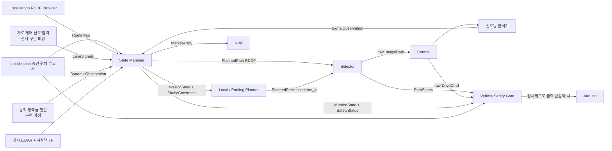

# RDDF State Manager

13개 논리 구간과 19개 RDDF 경로를 연결하는 ROS Noetic 미션 관리자다.
현재 구간, 미션 단계, 좌우 경로, 요청 플래너, 속도 상한과 정지 여부를 결정한다.
규정은 사용자가 제공한 `HL FMA{1_5] 경기규정.pdf` 1–5쪽을 기준으로 읽었다.
PDF 자체는 저장소에 포함하지 않는다. 시험장 현장 설정은 `config/missions.json`과
별도의 landmark 파일로 관리한다.

**이 코드는 미션 결정·경로 검증·LiDAR 정지 감독의 구현이다.** 신호/어린이 인식기,
S자 회피 플래너, 주차 기어 전환 플래너, 경로 추종 제어기는 이 저장소에서 아직
통합되지 않았다. 실제 차폭·제동 성능·정지선도 미측정 상태다. 기본 실행은 차량에
명령을 보내지 않는 preview 모드이며, 실제 경기 완주 또는 충돌 방지가 검증됐다는
뜻은 아니다.

## 연결 구조



RDDF 파일은 `mando_localization`이 읽어 `/route/map`으로 전달한다.
State Manager는 이 토픽을 사용하며 다른 패키지의 RDDF 파일을 직접 읽지 않는다.
Selector와 공유하는 순수 Python 검증 코어로 플래너 응답을 동일하게 확인한다.
`decision_id`는 경로·모드·요청 방향이 바뀔 때 변경된다. 플래너는 이 값을 그대로
응답해야 하며 이전 구간의 유효한 경로라도 새 요청에 재사용할 수 없다.
같은 미션 안에서 경로를 다시 계획하는 경우도 경로 형상의 fingerprint를
Selector와 LiDAR 승인에 함께 기록한다. 두 fingerprint가 일치할 때만 차량 출력을
허용하여 이전 경로의 안전 판단을 새 경로에 적용하지 않는다.

## 현재 작업 범위와 RViz 점검

1구간 경사로는 확정된 정지구역 앞·뒤 흰 선의 RDDF 중앙에서 정차하도록
설정했다. 2·4·7번 신호 정지선도 확정 좌표를 반영했다.
교차로 출구·주차 확인선·종료선은 사용자가 추후 RDDF에 마킹한다.
차량 제어, 실측 치수·제동 성능, 후진 인터페이스는 별도 작업을 병합할 예정이다.
당장 마킹이나 차량 파라미터를 채워 넣어 화면을 보기 위한 주행 허가를 만들지 않는다.

경로 구성은 **신호 구간 2·4·7에서 RDDF 추종, 주차 구간에서 좌우 RDDF 선택,
정적 장애물 회피 구간에서 로컬 경로 생성**이다. 다른 구간의 로컬 경로 적용은 추후 정한다.
아래 실행 로직은 현재 구현 기준이며, 3구간은 `LOCAL`을 필수로 요구하고 주차에는
`PARKING` 경로/단계 메시지를 요구한다. 주차 RDDF를 그 메시지로 제공하는 어댑터와
추가 로컬 경로 전환은 추후 연결 작업이다.

센서와 Localization을 실차 또는 rosbag으로 먼저 실행한 뒤, 다음 명령으로 한 RViz에서
매니저·RDDF ROI 인식 결과를 점검한다. `run.sh` 대신 점검 launch를 사용한다.

```bash
source devel/setup.bash
roslaunch state_manager inspection.launch
```

이 launch는 매니저, Selector, 출력이 꺼진 Safety Gate, ROI detector, 읽기 전용 inspection
노드와 RViz를 실행한다. 별도 object_detection 뷰어는 띄우지 않는다. 이미 매니저/인식기가
동작 중이면 중복 실행을 피하도록 아래 옵션을 사용한다. 기존 실행 프로세스의 출력 설정까지
이 launch가 바꾸지는 않으므로 점검은 차량 제어를 시작하지 않은 환경에서 한다.

```bash
roslaunch state_manager inspection.launch start_mission:=false start_detection:=false
```

| RViz 표시 | 확인할 내용 |
|---|---|
| 구간별 색상 RDDF, S01~S13 이름·시작/끝 점 | 전체 코스와 주차 좌우 경로 |
| 흰색 active route와 기존 mission status | 매니저가 진행 중인 구간·미션·단계·정지 이유 |
| 청록색 observed RDDF와 inspection status | Localization `/molit/localization/rddf/current`가 관측한 실제 구간 |
| RDDF/LOCAL/PARK 후보 경로 | 입력된 경로 형상·route·decision ID. 아직 주행이 허용되지 않아도 확인 가능 |
| 노란 `/path/final` | Selector가 내보낸 출력. 미설정 상태에서는 비어 있는 것이 정상 |
| 원본 LiDAR, ROI 내부 점, ROI 원, DBSCAN 군집 | 원본과 필터 결과 비교. DBSCAN 군집은 객체 종류나 움직임 판정이 아님 |
| Traffic signal / Lane signals / Dynamic observation | 매니저 입력 메시지의 값·신뢰도. 인식기가 미연결이면 `NO_DATA` |
| Safety / Selector 상태 | 현재 정지 이유, 경로 준비 여부 |

미설정 상태에서는 매니저가 `CALIBRATION_REQUIRED` 등에 머무를 수 있다. 차량이 다른
구간에 있을 때 inspection의 `Observed Sxx`는 별도로 확인할 수 있으며, 그 관측을 미션
완료/전환으로 사용하지 않는다. 위치가 모호하거나 invalid/stale이면 `UNKNOWN`으로 표시하고
청록색 강조를 지운다. 검사 노드는 제어·미션 토픽을 발행하지 않으며 marker만 발행한다.
위치가 갱신되지 않으면 RViz 카메라를 수동으로 이동해 화면의 상태 문구를 확인한다.

카메라는 신호등 인식에만 사용하고 결과를 `SignalObservation`으로 전달한다.
`LaneSignals`와 `DynamicObservation`은 카메라 경로에 묶지 않으며 입력 센서와 생산 노드를
별도로 결정한다. 이 입력들은 DBSCAN 결과를 그대로 연결하는 항목도 아니다. 현재 미연결
입력은 비어 있는 채 표시하며 가짜 신호로 주행 조건을 통과시키지 않는다.

검증: 순수 marker 테스트 및 ROS transport 테스트에서 미설정 매니저 S01과 관측 S07의
분리, 미수신 입력, stale 강조 제거를 검사한다. CI의 Localization은 실제 메시지 정의를
사용하는 message-only fixture이며, Localization 전체/인식기/실제 RViz 렌더링 검증은 아니다.
실차 또는 bag 점검에서는 RViz Displays의 TF 오류, 구간 강조 위치, ROI와 스캔 정합을 확인해야 한다.

## 구간별 처리

| 구간 | 미션과 처리 | 완료·전환 기준 |
|---|---|---|
| 1 left/right | 앞·뒤 정지구역 마커 중앙 접근, 연속 3초 이상 정차, 재출발 | 경사로 정상 통과 후 2로 연결. 0.5m 이상 밀림은 fault |
| 2 | 비허용 신호에서 정지선 가상 벽, fresh `GREEN`에서 RDDF 직진 | 허가 후 교차로를 빠져나갈 때까지 진입 상태 유지 |
| 3 | S자 정적 장애물 회피 | `LOCAL` 경로 필수. 없거나 충돌/미관측이면 정지 |
| 4 | 2와 같은 신호 처리 + T 주차 좌/우 공간 미리 관측 | 교차로 통과·구간 끝·선택 공간 관측 확인 후 5 |
| 5/6 | 선택한 T 주차 진입/출차 경로를 한 쌍으로 유지 | 후진 주차 확인선·자세 확인, 정지 후 전진 출차 |
| 7 | 정지선 가상 벽에서 `LEFT_ARROW` 대기, 허용 시 RDDF 좌회전 | 일반 녹색으로 좌회전 허가를 대신하지 않음 |
| 8 | 고주로 동적장애물 대비, 발견 시 정지 | 어린이가 중앙에서 멈춘 뒤 차량 완전 정지 3초. 장애물이 치워지고 경로가 관측상 안전해야 재출발 |
| 9 | 기준경로 추종 + 평행주차 좌/우 미리 관측 | 구간 끝에서 확인된 쪽 10으로 연결 |
| 10/11 | 선택한 평행주차 진입/출차 쌍 유지 | 후진 주차 확인선·자세 확인, 정지 후 전진 출차 |
| 12 | 차로 제어 신호 `DOWN`/`X` 관측, 분기 준비 | 왼쪽은 RDDF 12 중간 분기점에서, 오른쪽은 끝에서 13 진입 |
| 13 left/right | 진입 전에 허용된 차로 주행 | 뒷바퀴가 종료선을 지난 뒤 정지 |

주차 후보는 LiDAR로 전체 진입·출차 경로의 차체 폭/앞뒤 돌출부/여유 폭을 검사한다.
연속된 서로 다른 3개 관측에서 `CLEAR`인 후보를 선택한다. 선택 후 진입 전까지
막히면 다른 후보로 재선택할 수 있고, 진입한 뒤에는 좌/우 쌍을 고정한다.
한쪽이 보이지 않거나 가려졌으면 `UNKNOWN`이다. 장애물이 안 찍혔다는 이유만으로
빈 공간으로 간주하지 않는다. 모든 후보가 미확인이면 현장 가시성 또는 별도 관측
플래너가 필요하며, 이 구현은 확인을 위해 임의로 전진하지 않는다.

RDDF의 주차 `reverse` 표시는 **시작 차체 방향** 메타데이터다. T 주차의 전진 접근→
후진 삽입→전진 출차와 평행주차의 혼합 기어 동작 전체를 나타내지 않는다.
5/10 진입에서는 `/parking/maneuver`로 받은 단계별 계획을 승인한다. T 주차는
`FORWARD_APPROACH(+1) → REVERSE_ENTRY(-1)`, 평행주차는 전진 준비 후 후진 또는
후진부터 시작하는 계획을 지원한다. 6/11은 `FORWARD_EXIT(+1)`다. 시작점과 이전
단계의 목표점에서 차량의 실제 정지를 확인해야 새 단계를 받아들인다. 마지막 후진
목표점은 측정한 주차 확인선과 같아야 하며, 완료 플래그로 이 검사를 대신할 수 없다.
단계가 바뀌면 방향이 같아도 decision_id를 갱신하고 새 계획 경로를 기다린다.

RDDF 접선과 차체 방향이 다른 주차 접근에서는 RDDF의 시작 방향 플래그 대신 실제
플래너 경로의 차체 자세를 검사한다. 이 때문에 10-right의 전진 접근을 처음부터
후진으로 해석하던 문제가 해소된다. 실제 곡률·기어 피드백·주행 가능한 궤적 생성은
Parking Planner와 차량 제어의 책임이다. 현재 `DriveCmd`는 부호 없는 정수 KPH와
조향·브레이크만 있으므로 Safety Gate는 후진 요청을
`REVERSE_INTERFACE_UNAVAILABLE`로 항상 막는다. 설정만 켜서 해결되지 않는다.

## 신호 정지선 가상 벽과 RDDF 추종

비전은 `/perception/traffic_signal`의 `SignalObservation`을 State Manager에 보낸다.
`route_name`은 현재 신호가 속한 `2`, `4`, `7`, `header.stamp`는 실제 관측 시각,
`value`는 `RED`/`YELLOW`/`GREEN`/`LEFT_ARROW`/`UNKNOWN`을 사용한다.
기본 신뢰도 하한은 0.8, 유효 시간은 0.5초다. 다른 구간·미래 시각·오래된 관측은
진입을 허용하지 않는다. 일반 초록불과 좌회전 화살표는 구분해야 한다.
`junction_id`는 전달되지만 현재 허가 판단은 `route_name`으로 구분하므로,
비전이 다른 교차로의 신호를 현재 구간 이름으로 잘못 붙이지 않아야 한다.

- 2·4구간: fresh `GREEN`에서 벽 해제, 기존 RDDF를 따라 직진한다.
- 7구간: fresh `LEFT_ARROW`에서 벽 해제, 기존 좌회전 RDDF를 따라간다.
- 적색·황색·불명·신호 단절: 진입 전에는 벽을 유지한다. 정지선까지 접근할 경로는 남긴다.
- 통과 허가 후 앞범퍼가 정지선을 넘어 진입한 상태에서는 신호 변경만으로 벽을 다시 세우지 않는다.
  LiDAR 장애물·위치 이상에 의한 정지는 계속 적용된다.

`/path/rddf`의 끝을 `stop_line_s - vehicle.front_m - stop_buffer_m`까지만 생성한다.
현재 관측을 매 tick에 반영하므로 초록→빨강에서는 다시 잘리고, 허용 신호에서는 전체
lookahead가 복원된다. 후보 경로가 제한을 넘으면 매니저 안전 검사도
`PATH_CROSSES_VIRTUAL_STOP`으로 거부한다. 정지선 미설정 시 신호 구간 경로는 비어 있으며,
보정·위치·LiDAR·경로 검사를 통과해야 움직일 수 있다.

RViz `/mission/markers`에 정지선의 붉은 수직 벽과 `STOP WALL`/`RDDF OPEN` 문구가 나온다.
벽 폭은 차폭+1m(차폭 미설정 시 표시용 3m)이며 실제 차로 폭의 측정값이 아니다.
플래너 제한은 벽 그림의 옆을 돌아가는 우회를 허용하지 않는 **해당 RDDF 진행거리 제한**이다.
마커는 0.5초 뒤 만료되므로 갱신이 끊긴 화면을 현재 상태로 오인하지 않아야 한다.

추후 로컬 플래너에는 `/mission/traffic_constraint` (`planning_interfaces/TrafficConstraint`)를 연결한다.
`active`, `stop_line_s`, `target_s`, `stop_line_pose`, `required_signal`을 제공하며,
`route_name`/`decision_id`가 현재 MissionState와 일치하는 fresh·valid 제약만 사용해야 한다.
신호 구간에서 제약이 없거나 stale/invalid이면 통과 가능한 것으로 취급하면 안 된다.
`stop_line_pose`의 방향은 진행 방향이며 그에 수직인 선이 정지선이다. 이 메시지는
실제 LaserScan에 가짜 장애물을 섞지 않는다. 현재 RDDF 생성기는 연결되어 있고,
외부 로컬 플래너가 이 계약을 소비하는 구현은 해당 플래너를 추가할 때 연결한다.

## 경사로 앞·뒤 마커와 3초 정차

확정된 경사로 RDDF 마킹은 경로별 `hill_zone_start_s`와 `hill_zone_end_s`로 연결했다.
값은 해당 RDDF의 시작부터 계산한 누적거리(m)다. 인덱스로 주면 그 지점의 누적거리로
변환해 보정 파일에 기록할 수 있으며 RViz 클릭 편집기도 두 키를 지원한다.
원본 마커 CSV와 전역 RDDF의 투영 결과는
[`yongin_mission_landmarks.json`](../localization/rddf/yongin_mission_landmarks.json)에 기록했다.
경사로 왼쪽 정차 목표는 s=31.028786m, 오른쪽은 s=30.877562m다.

두 값은 **정차가 허용된 영역의 앞·뒤 경계**이며 경사로 전체 시작/정상과 구분한다.
이미 정지구역 경계이므로 각각에 1m를 다시 더하거나 빼지 않는다.
후륜축 `base_link` 목표는 `(hill_zone_start_s + hill_zone_end_s) / 2`다.
곡선에서도 두 좌표를 직선으로 평균내지 않고 RDDF를 따라 중앙점을 구한다.
쌍이 있으면 기존 `hill_stop_s`보다 우선하고, 한쪽만 있거나 순서·범위가 틀리면 미션을 막는다.
기존 `hill_start_s`/`hill_stop_s`/`hill_top_s` 설정은 두 새 마커가 모두 미설정일 때 지원한다.

규정상 정차는 **3초 이상**이다. 중앙 목표의 정지 허용오차 안에서 속도와 위치가
연속적으로 안정된 시간만 누적한다. 음의 속도, 속도 임계치 초과, 기준 위치에서의
변위 초과, 위치/센서 유효성 상실은 누적 시간을 초기화한다.
위치 비교에는 단조 증가 진행률 대신 `raw_s`와 실제 map상의 x/y를 사용한다.
`hill_hold_position_tolerance_m` 기본값 0.02m는 위치 잡음을 구분하기 위한 임시 설정으로,
센서 정밀도와 정차 제어를 실측해 검증해야 한다. `stop_tolerance_m` 기본값은 0.2m다.
RViz에는 앞·뒤 마커와 중앙 목표, 현재 정차 누적 시간이 표시되고 diagnostics에도 기록된다.

매니저는 정지 요청을 유지하고 정차 완료를 판단한다. 브레이크 유지·재출발 순간의
밀림 방지는 추후 병합할 제어기의 역할이며 아직 실차에서 검증하지 않았다.
경사로 두 경계와 2·4·7번 정지선은 설정됐다. 교차로 출구와 차량
파라미터는 미설정 상태를 유지한다.


## 규정 처리와 적용 범위

- 경사로: 시작 1m 이후부터 정상 1m 전까지의 정지 구역에서 3초. 최초 해당 정지부터
  정지구역 정상 쪽 경계 통과까지 30초를 감시한다. 정지 여부는 부호 있는 실제 속도와
  정차 시작 위치 대비 변화를 함께 확인한다. 기존 ramp/target 세 필드 방식도 지원한다.
- 신호: 2/4는 GREEN, 7은 LEFT_ARROW만 새 진입을 허용한다. 이미 허가받고 진입한
  교차로에서는 신호가 바뀌었다고 신호 조건만으로 급정지하지 않는다. 별도 LiDAR 정지는
  계속 우선한다. 교차로 정지 3초·20초, 통과 30초 초과는 진단에 기록한다.
- 8구간: **어린이가 중앙에 정지한 시점 이후** 완전 정지 3초가 필요하다.
  단순 LiDAR 물체 검출만으로 어린이 종류나 중앙 정지를 추정하지 않는다.
  `DynamicObservation` 생산자가 이를 판단해야 한다. 기본 설정에서는 우회하지 않고
  장애물 제거와 경로 안전 확인을 기다린다.
- 유효한 위치로 실제 출발한 시점부터 전체 8분 및 장시간 무동작을 진단한다. 정지선 전 1m 이내에서 fresh RED에 따라
  멈춘 연속 시간은 주행 시간에서 뺀다. 시간 초과가 강제 출발을 유발하지는 않는다.
- 차선·중앙선 준수, 범퍼/뒷바퀴와 실제 선의 접촉, 미세 연석의 관측은 센서 정밀도와
  현장 검증에 의존한다. 이 코드가 심판 판정을 대신하거나 모든 감점 조건을 자동
  판정하는 것은 아니다. 경로 추종/플래너가 주행 가능 영역도 검증해야 한다.

## 설정과 RViz에서 위치 지정

RDDF CSV에는 각 점의 좌표·인덱스·누적거리·접선 방향이 있다. 하지만
`정지선`, `경사로 정상`, `주차 확인선`이라는 의미 필드는 없다. 구간 경계는
기존 RDDF 그대로 사용하고, 구간 내부의 규정상 위치만 한 번 지정한다.

```bash
source /opt/ros/noetic/setup.bash
catkin_make
source devel/setup.bash
roslaunch state_manager mission.launch calibration_mode:=true start_rviz:=true
```

이 모드는 차량 출력을 끄며 State Manager의 주행 유효성을 false로 유지한다.
Localization과 센서 드라이버는 별도로 실행한다. 예를 들어 기존 LiDAR 드라이버는
`roslaunch lidar_bringup rplidar_s2.launch scan_topic:=/molit/sensors/lidar/scan frame_id:=laser_link publish_static_tf:=false`로 연결한다.
이때 Localization이 실측된 `base_link→laser_link` TF를 발행해야 한다. 드라이버의
기본 `/scan`·`laser` 설정과 중복 TF를 그대로 사용하지 않는다. RDDF는 위치 입력
없이도 표시된다.
RViz의 `Publish Point` 도구로 지도 위 위치를 클릭하기 전에 대상 의미를 선택한다.

```bash
rosservice call /landmark_editor/set_target "route_name: '2'
landmark: 'stop_line_s'"
```

클릭 결과를 해당 RDDF 점에 맞춰 누적거리와 원본 인덱스를
`~/.ros/stier/landmarks.json`에 기록한다. RViz에 찍은 지점이 실제 선인지는 현장에서
확인해야 한다. `calibration_file:=/원하는/경로.json`으로 저장 위치를 바꿀 수 있다.
기록할 때마다 검증 플래그를 해제하며, 파일 교체는 원자적으로 처리한다.

| 의미 | 입력해야 하는 기준 |
|---|---|
| `hill_zone_start_s`, `hill_zone_end_s` | 새 RDDF의 허용 정지구역 앞·뒤 경계. 중앙 목표 자동 계산 |
| `hill_start_s`, `hill_top_s` | 실제 경사로 시작/정상에 대응하는 RDDF 누적거리 |
| `hill_stop_s` | 그 사이 규정상 정지구역에 차량 기준점이 서야 할 누적거리 |
| `stop_line_s` | 실제 정지선의 누적거리. 런타임이 측정된 전방 범퍼 오프셋을 적용 |
| `intersection_exit_s` | 뒷바퀴가 교차로 출구 횡단보도를 완전히 통과할 기준 |
| `parking_confirm_s` | 뒷바퀴가 확인선에 닿았을 때의 기준점 위치. 다음 출차 경로 시작점과 연결되어야 함 |
| `parking_yaw_rad` | 주차 완료 차체 방향. 클릭으로 생성하지 않고 측정한 rad 값을 JSON에 입력 |
| `parking_exit_s` | 주차 출차 확인선을 넘었을 때의 기준점 위치 |
| `lane_decision_s` | 12→13 left의 실제 RDDF 분기 누적거리. 현재 파일은 index 36, 약 13.258m |
| `finish_s` | 뒷바퀴가 통과할 실제 종료선. RDDF에 종료 후 제동 여유가 남아 있어야 함 |

현재 Localization의 `base_link` 기준점은 뒷차축이다. 다른 기준점을 사용한다면
범퍼·차축 오프셋과 모든 landmark 의미를 함께 다시 맞춰야 한다. 주차 확인선이나
종료선이 RDDF 끝점이라고 임의로 가정하지 않는다. 실제 확인선이 RDDF 연결점과
다르면 경로도 수정해야 한다.

모든 좌/우 경로에 필요한 항목을 기록한 뒤 검증한다.

```bash
rosservice call /landmark_editor/validate
```

또한 `config/missions.json`을 작업용 파일로 복사하고 다음 차량 값을 측정해 입력한다.
`width_m`, `front_m`, `rear_m`는 `base_link` 기준 차체 외곽이다.
`deceleration_mps2`와 `reaction_s`는 제어·통신·센서 지연을 포함해 실측한다.
`max_speed_mps`와 `max_yaw_rate_rps`는 스캔 중 허용되는 최대 이동/회전 속도다.
측정 속도가 이 범위를 벗어나면 정지하며, 주행 명령 속도도 이 상한으로 제한한다.
`vehicle.validated`와 `vehicle.curb_visibility_validated`는 측정/검증 후에만 true로
설정한다. 실제 차량값은 기본 파일에 넣어 두지 않았다. 1 KPH 명령의 제동거리와
정지 여유가 정지 허용 오차보다 크면 현재 정수 속도 인터페이스로 정밀 정지가
불가능하므로 런타임이 차량 설정을 거부한다.

검증 시 RDDF 형상·이름·방향의 digest를 저장한다. RDDF를 수정하면 이전 검증을
자동으로 거부하며, 좌표가 바뀐 landmark는 다시 지정해야 한다.

설정 파일과 landmark는 시작 시 읽는다. 주행 중 편집/자동 적용하지 않는다.
설정 후 노드를 재시작하고 preview 결과를 확인한다.

```bash
roslaunch state_manager mission.launch config_file:=/측정완료/vehicle-missions.json start_rviz:=true
rostopic echo /mission/state
rostopic echo /mission/safety
rostopic echo /vehicle_safety/status
```

RViz에는 모든 RDDF, 활성 경로, 구간 이름, 현재 위치, 미션·단계·진행률과 정지 사유가
표시된다. 유효하지 않은 위치는 주행 판단에 사용하지 않는다. 위치 freshness, 좌표계,
공분산, 경로와의 거리·방향, 불가능한 위치 도약을 감시한다. 정확한 위치를 새로
만드는 기능은 아니며 Localization 품질이 낮으면 정지한다.

## 인지·플래너 인터페이스

메시지는 `planning_interfaces`에 정의되어 있다. 모든 길이는 m, 시간은 ROS 시각,
경로 프레임은 `map`, `PlannedPath`의 자세는 **차체 방향**이다.

| 토픽 | 타입 | 생산자 책임 |
|---|---|---|
| `/route/map` | `RouteMap` | Localization 소유 RDDF 전체와 origin 제공 |
| `/perception/traffic_signal` | `SignalObservation` | route_name=2/4/7, 신호값·confidence·실제 측정 시각 |
| `/perception/lane_signals` | `LaneSignals` | 좌/우 각각 DOWN/X/UNKNOWN. 일반 신호등과 분리 |
| `/perception/dynamic_obstacle` | `DynamicObservation` | 어린이 검출과 중앙 정지 여부를 fresh 관측으로 발행 |
| `/parking/maneuver` | `ParkingManeuver` | 현재 요청 ID를 반영한 주차 단계·방향·RDDF 시작/목표 거리 |
| `/mission/state` | `MissionState` | 활성 요청, decision_id, 속도·정지 제약 |
| `/mission/traffic_constraint` | `TrafficConstraint` | 신호 정지선 벽 상태·진행거리 제한·선 위치. future Local Planner용 계약 |
| `/path/rddf`, `/path/local`, `/path/park` | `PlannedPath` | 요청 id/route/direction 일치, 유효한 자세·연속 경로 |
| `/path/selector_status` | `PathStatus` | 경로 준비 여부. 정지 중에도 readiness는 갱신 |
| `/path/final` | `nav_msgs/Path` | Control용 최종 경로. invalid이면 비움 |
| `/mission/safety` | `SafetyStatus` | LiDAR/위치 상태와 최종 경로의 정지 판단 |
| `/mission/diagnostics` | `std_msgs/String` JSON | 경기 시간·제외 신호 대기·완료 미션·규정 진단 |
| `/mission/markers` | `visualization_msgs/MarkerArray` | RViz 표시 |
| `/pure_pursuit/raw_drive` | `erp42_msgs/DriveCmd` | 제어기 출력. 최종 차량 토픽 직접 발행 금지 |

주차 플래너는 새 미션의 `decision_id`, `route_name`을 받아 `ParkingManeuver`를
계속 발행한다. 필드는 `leg_index`(0부터), `phase`, `direction`, `start_s`, `target_s`,
`final_leg`이며 `header.frame_id=map`과 실제 계획 시각을 넣는다. 첫 단계 시작은
해당 RDDF의 s=0이며 목표는 시작보다 커야 한다. 역방향 주행도 RDDF 점의 나열
순서에 따른 누적거리는 증가한다. 승인 후 MissionState의 `parking_leg_*`를 확인하고,
갱신된 decision_id로 동일한 단계와 `/path/park`를 다시 발행해야 한다. 승인된 단계의
시작/목표/방향을 몰래 바꾸거나 움직이는 동안 다음 단계로 전환하면 정지한다.

LOCAL은 향후 선택할 로컬 플래너용 경계다. 정적 장애물 구간에서는 RDDF로 자동
fallback하지 않는다. PARKING 역시 전용 플래너 응답이 없으면 진행하지 않는다.
미래 시각·낡은 관측·다른 구간의 신호·낮은 confidence는 허가로 쓰지 않는다.
ROS를 정지했다 다시 시작한 경우 새 경기 실행을 위해 State Manager도 재시작한다.

## 상시 LiDAR 감독과 검증 범위

모든 구간에서 LiDAR freshness와 측정 시각의 TF를 확인한다. 선택된 경로 위에서
실제 속도에 따른 제동거리와 차체의 회전·돌출부를 검사한다. 유한한 반사점은
연석인지 라바콘인지 몰라도 차체 영역과 겹치면 정지 사유가 된다. 미관측 부채꼴,
가림 뒤 공간, NaN 빔은 빈 공간으로 처리하지 않는다. 현재 차체 내부만 관측 범위
검사에서 제외하며, 그 안의 실제 반사점까지 제거하지 않는다.

스캔 각 빔에 대한 이동 보정(deskew)은 아직 없으며 첫 빔 시각의 TF를 사용한다.
최대 이동·회전 속도와 스캔 소요 시간, 센서 최대거리로부터 스캔 변형의 상한을
계산해 검사 여유 폭에 더하고, 위치 공분산도 여유에 반영한다. 이 보수적인 여유가
좁은 코스에서 정지를 유발하면 실제 이동 보정과 센서 검증으로 관측 오차를 줄여야
한다. 단순히 관측되지 않은 공간을 안전하다고 바꾸어 해결하지 않는다.

2D LiDAR 높이 때문에 낮은 연석이 스캔 평면에 들어오지 않을 수 있다. 경사로에서는
센서 평면이 기울어지므로 TF 기울기와 현장 가시성을 검증해야 한다. 너무 기울어진
스캔은 차단한다. `curb_visibility_validated`는 장착·노면 실험을 기록하기 위한
설정이며 연석 검출 알고리즘이나 충돌 방지 보증이 아니다. 필요하면 낮은 연석용
추가 센서 또는 3D 지면 분리가 필요하다.

다음은 ROS 없이 실행 가능한 회귀 테스트다.

```bash
python3 -m unittest discover -s src/state_manager/test -v
python3 -m unittest discover -s src/selector/test -v
python3 -m unittest discover -s src/vehicle_safety/test -v
```

전체 13개 미션을 차량 연결 없이 논리 입력으로 재생할 수 있다.

```bash
python3 src/state_manager/examples/replay_missions.py --parking-branch left --lane right --output /tmp/stier-replay.json
```

이 재생기는 실제 MissionEngine·Selector·Safety Gate를 사용하지만 위치·신호·주차
계획은 **합성 시험 입력**이다. 물리적인 차량 시뮬레이터나 현장 측정 결과가 아니다.
후진 출력은 재생 중에도 거부됨을 함께 기록한다. JSON에는 구간·단계·방향·요청 ID와
정지 이유를 남긴다. `test_pipeline.py`는 위치 추적을 포함한 Runtime 연결과 센서
단절, 경로 갱신 경쟁 조건을 별도로 재현한다.

ROS Noetic 호스트 또는 브랜치의 GitHub Actions `State manager` 작업은 다음 검증을 실행한다.

```bash
bash src/state_manager/scripts/verify_noetic.sh
```

임시 Catkin 작업공간에서 공유 메시지와 State Manager·Selector·Safety Gate를 빌드한 뒤,
ROS 테스트로 실제 토픽 통신·RViz marker 발행·기본 보정 차단·preview 명령·센서 만료
정지를 확인한다. 차량 명령 publisher가 생성되지 않는지도 검사한다. 이 빌드에는
센서 드라이버와 Localization C++ 스택을 포함하지 않으며 현장 통합 시험과 구분한다.

실차 적용 전 Ubuntu/Noetic에서 catkin 빌드, rosbag 재생, 센서 단절·위치 도약·신호
변경·막힌 주차칸·어린이 정지 시나리오를 확인해야 한다. macOS 개발 환경에서는
Python 회귀 테스트와 소스/launch 정적 검증만 실행할 수 있다.
